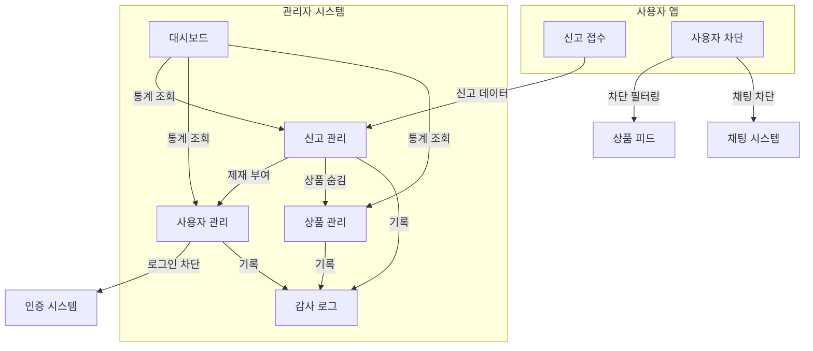
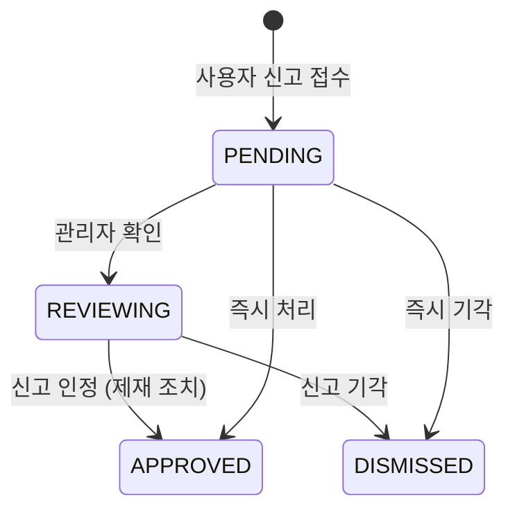
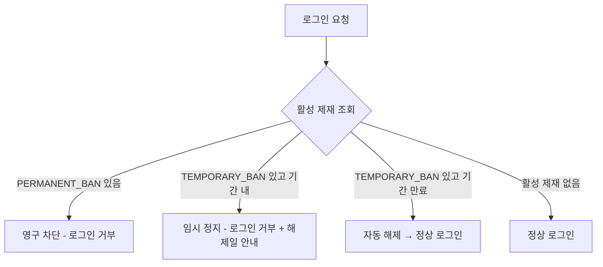
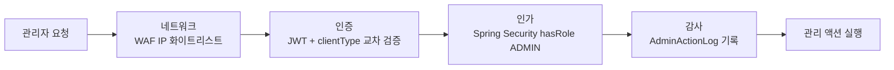
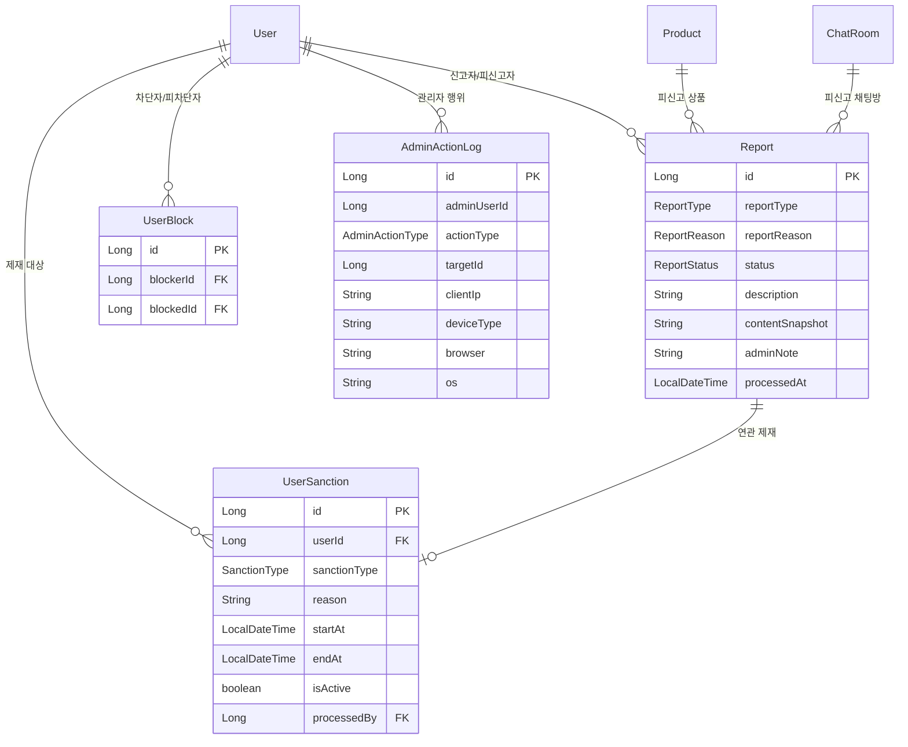

# Admin Domain Architecture

> 관리자 시스템: 신고 처리, 사용자 제재, 상품 관리, 감사 로그

## 도메인 개요

## 신고 시스템

사용자가 부적절한 상품, 사용자, 채팅을 신고하면 관리자가 검토 후 처리한다.

### 신고 플로우

### 신고 유형

| 유형 | 진입점 | 피신고자 결정 |
|------|--------|-------------|
| 상품 신고 | 상품 상세 메뉴 | 자동 (판매자) |
| 사용자 신고 | 프로필 메뉴 | 직접 지정 |
| 채팅 신고 | 채팅방 메뉴 | 자동 (채팅 상대방) |

### 신고 처리 액션

| 액션 | 효과 |
|------|------|
| 기각 | 신고 기각, 추가 조치 없음 |
| 경고 | 사용자에게 경고 기록 (영구 누적) |
| 상품 숨김 | 해당 상품을 피드/검색에서 제거 |
| 임시 정지 | 로그인 차단 (1일/3일/7일/30일) |
| 영구 차단 | 로그인 영구 차단 |

## 제재 시스템

사용자 상태는 별도 테이블에서 파생한다. User 테이블에 status 컬럼을 두지 않고, 제재 이력 테이블에서 활성 제재 여부를 계산한다.

### 상태 판별

### 제재 유형

| 유형 | 해제 | 누적 |
|------|------|------|
| 경고 (WARNING) | 해제 불가 | 영구 누적 |
| 임시 정지 (TEMPORARY_BAN) | 기간 만료 시 자동 해제 | - |
| 영구 차단 (PERMANENT_BAN) | 관리자 수동 해제만 가능 | - |

## 차단 시스템

사용자 간 차단 기능. 단방향 차단 (차단한 측에게만 영향).

### 차단 시 필터링 범위

| 영역 | 동작 |
|------|------|
| 상품 피드/검색/트렌딩 | 차단한 사용자의 상품 제외 |
| 좋아요 목록 | 차단한 사용자의 상품 제외 |
| 채팅 | 신규 생성 불가 + 기존 채팅 메시지 송수신 차단 |
| 상품 상세 | 접근 허용 (거래 이력 확인 보장) |
| 프로필 | 접근 허용 + 차단 상태 표시 (차단 해제 경로 보장) |

### 차단 정책

- **단방향**: A가 B를 차단 → A에게만 B가 숨겨짐. B는 변화 없음.
- **채팅**: 양방향 차단 (MVP). 어느 한 쪽이라도 차단하면 메시지 송수신 불가.
- **차단당한 측**: 차단 사실을 알 수 없음.

## 관리자 보안 아키텍처

### 4중 방어

| 레이어 | 우회 시나리오 차단 |
|--------|------------------|
| 네트워크 | 외부에서 관리 페이지/API 접근 자체 불가 |
| 인증 | 일반 사용자가 관리자로 로그인 불가 (clientType 교차 검증) |
| 인가 | JWT를 조작해도 서버에서 역할 강제 검증 |
| 감사 | 모든 관리 행위를 IP + 기기 정보와 함께 추적 |

### 감사 로그

모든 관리자 액션은 자동 기록된다:

- **기록 대상**: 로그인, 신고 처리, 제재 부여/해제, 상품 숨김/삭제
- **기록 항목**: 관리자 ID, 액션 유형, 대상 ID, IP, User-Agent (기기/브라우저/OS 파싱)
- **조회 불가 액션은 기록하지 않음** (목록 조회, 상세 조회 등)

## 데이터 모델

