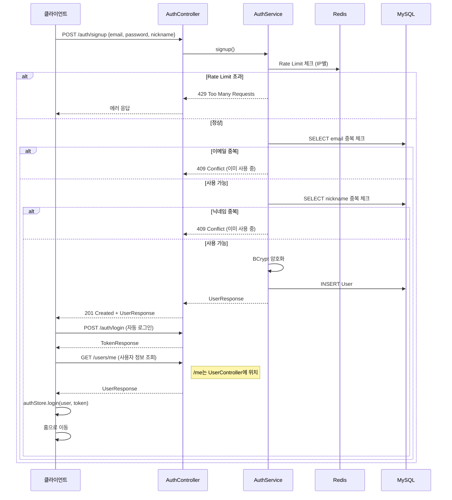
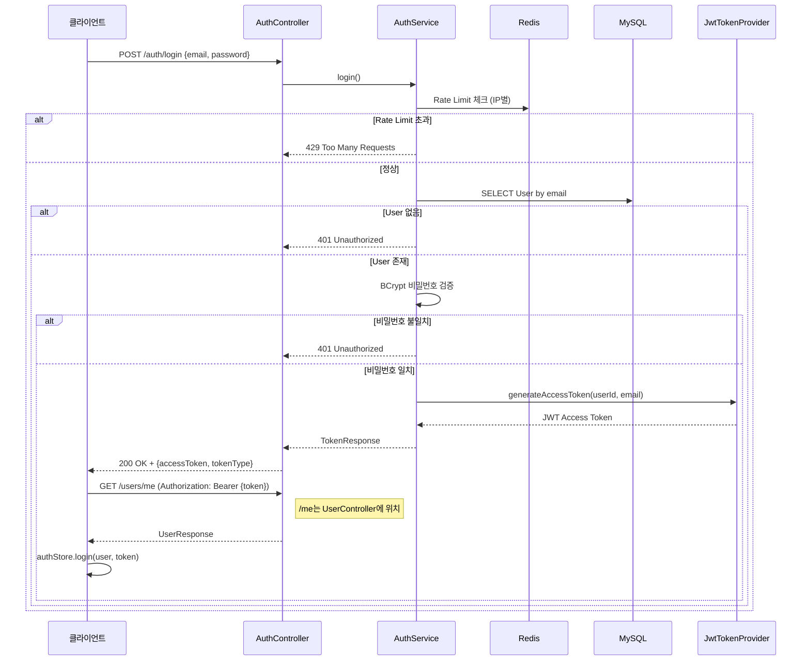
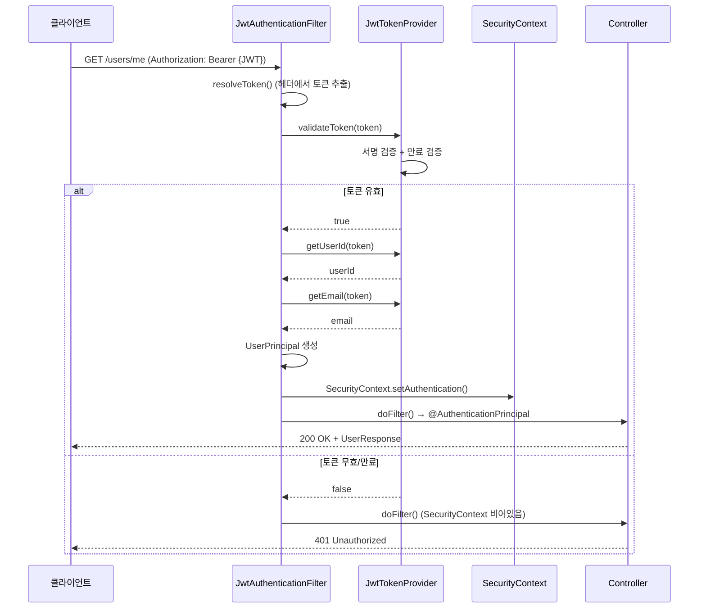
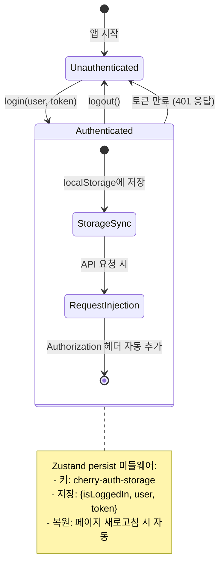
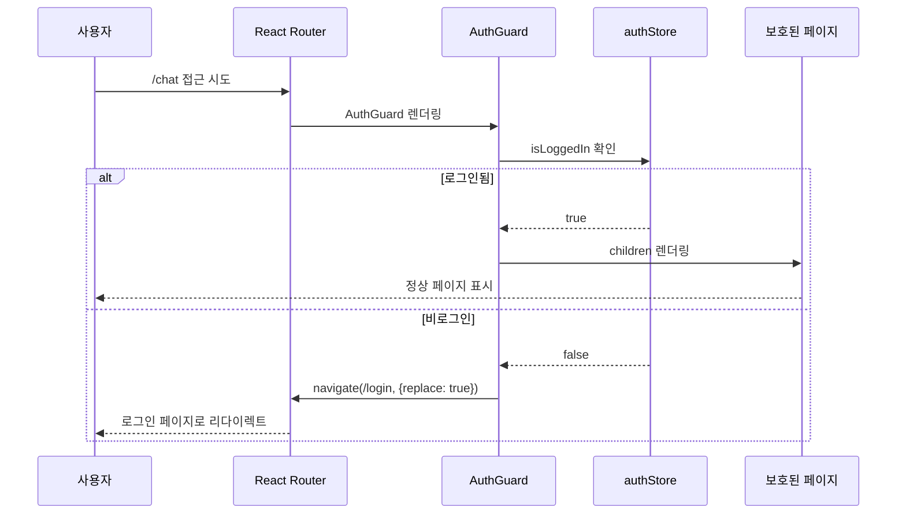

# 인증 도메인 아키텍처

- **Phase**: 1
- **상태**: 완료

---

## 1. 개요

JWT 기반 Stateless 인증 시스템. Access Token만 사용하며, Refresh Token은 미구현 상태.

**핵심 제약:**
- Access Token만 사용 (Refresh Token 미구현)
- 토큰 만료 시 재로그인 필요
- localStorage 기반 토큰 저장

---

## 2. 기술 스택

| 구성 요소 | 기술 | 역할 |
|-----------|------|------|
| 인증 방식 | JWT (HMAC-SHA256) | Stateless 인증 토큰 발급/검증 |
| 암호화 | BCrypt | 비밀번호 단방향 해시 |
| 보안 필터 | Spring Security Filter Chain | 요청 인증/인가 처리 |
| Rate Limit | Redis | IP 기반 요청 빈도 제한 |
| 상태 관리 | Zustand + localStorage persist | 클라이언트 인증 상태 관리 |
| 라우트 보호 | AuthGuard | 비로그인 사용자 리다이렉트 |

---

## 3. 데이터 모델

```
users
├── id (PK, BIGINT AUTO_INCREMENT)
├── email (VARCHAR, UNIQUE, NOT NULL)
├── nickname (VARCHAR, UNIQUE, NOT NULL)
├── password (VARCHAR, NOT NULL, BCrypt hash)
├── profile_image_url (VARCHAR, nullable)
├── created_at (DATETIME)
└── updated_at (DATETIME)
```

---

## 4. 인증 흐름

### 4.1 회원가입



### 4.2 로그인



### 4.3 인증된 요청



---

## 5. 보안 계층

| 계층 | 내용 | 실패 시 |
|------|------|---------|
| JwtAuthenticationFilter | 모든 요청에서 JWT 검증 (서명 + 만료) | 401 |
| SecurityConfig | URL 기반 인증 규칙 (first-match) | 403 |
| Rate Limiting | Redis 기반 IP별 요청 빈도 제한 | 429 |
| BCrypt | 비밀번호 단방향 해시 (cost factor 기본값) | - |
| JwtAuthenticationEntryPoint | 인증 실패 시 JSON 에러 응답 | 401 |
| JwtAccessDeniedHandler | 권한 부족 시 JSON 에러 응답 | 403 |

### SecurityConfig 규칙 우선순위 참고

Spring Security는 **first-match** 방식이므로, 더 구체적인 경로를 먼저 선언해야 합니다.

```java
// 올바른 순서 예시
.requestMatchers("/products/my").authenticated()          // 먼저
.requestMatchers("/products/**").permitAll()              // 나중
```

**현재 규칙:**
- `/error` → permitAll (내부 에러 처리 시 401 방지)
- `/ws/**` → permitAll (WebSocket 연결은 STOMP CONNECT에서 JWT 검증)
- `POST /auth/**` → permitAll (로그인/회원가입)
- `/chat/**` → authenticated (채팅 API)
- `/products/my` → authenticated (내 상품 조회)
- `/products/**` → permitAll (상품 목록/상세)

---

## 6. 프론트엔드 아키텍처

### 6.1 구성

```
features/auth/
├── model/authStore.ts          # Zustand + localStorage persist
├── pages/LoginPage.tsx         # 로그인 페이지
├── pages/SignupPage.tsx        # 회원가입 페이지
└── components/AuthGuard.tsx    # 라우트 보호 컴포넌트

shared/services/
├── api.ts                      # fetch 기반 HTTP 클라이언트
└── authApi.ts                  # 인증 API 함수 (signup, login, getMe)
```

### 6.2 토큰 관리



**토큰 주입:**
- `authenticatedGet/Post/Put/Patch/Delete` 함수가 `Authorization: Bearer {token}` 헤더 자동 추가
- 토큰 만료 시 401 응답 → 클라이언트에서 재로그인 필요 (자동 갱신 없음)

### 6.3 라우트 보호



**구현:**
- `useEffect`에서 `isLoggedIn` 체크
- 비로그인 시 `/login`으로 리다이렉트 (`replace: true`)
- 로그인 후 `navigate(-1)` 또는 탭 복귀로 원래 위치 복귀

---

## 7. 설계 결정 요약

| 결정 | 선택 | 근거 |
|------|------|------|
| 인증 방식 | JWT Stateless | 서버 세션 불필요, 수평 확장 용이 |
| 토큰 저장 | localStorage | 구현 단순, HttpOnly Cookie 미사용으로 XSS 리스크 존재 (MVP 단계에서 수용) |
| Refresh Token | 미구현 | MVP 단계, 사용자 피드백 후 도입 |
| Rate Limiting | Redis IP별 카운터 | 무차별 대입 공격 방어 |
| 비밀번호 해시 | BCrypt | 업계 표준, Rainbow Table 공격 방어 |
| 라우트 보호 | AuthGuard 컴포넌트 | 선언적 보호, React Router 통합 |

---

## 8. 확장 포인트

| 항목 | 현재 | 확장 시 |
|------|------|---------|
| Refresh Token | 미구현 | RT + 자동 갱신 로직 추가 |
| 소셜 로그인 | 미구현 (UI만 존재) | OAuth2 (Google, Kakao, Naver) |
| 프로필 이미지 | 미구현 (UI만 존재) | S3 업로드 + Lambda 리사이즈 연동 |
| 이메일 인증 | 미구현 | SES + 인증 코드 발송 |
| 자동 로그인 | 미구현 (UI만 존재) | Remember Me 토큰 (별도 테이블) |
| 비밀번호 찾기 | 미구현 (UI만 존재) | 이메일 인증 + 토큰 기반 리셋 |
| 2FA | 미구현 | TOTP (Google Authenticator) |
