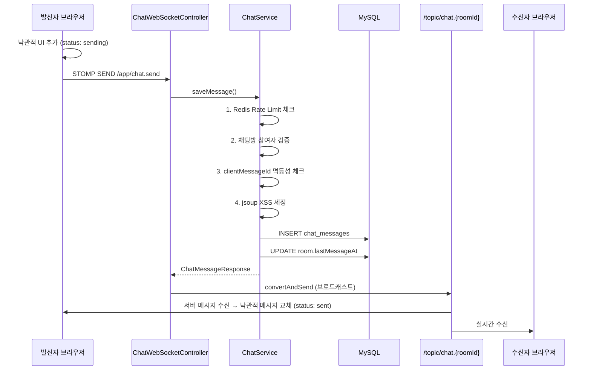
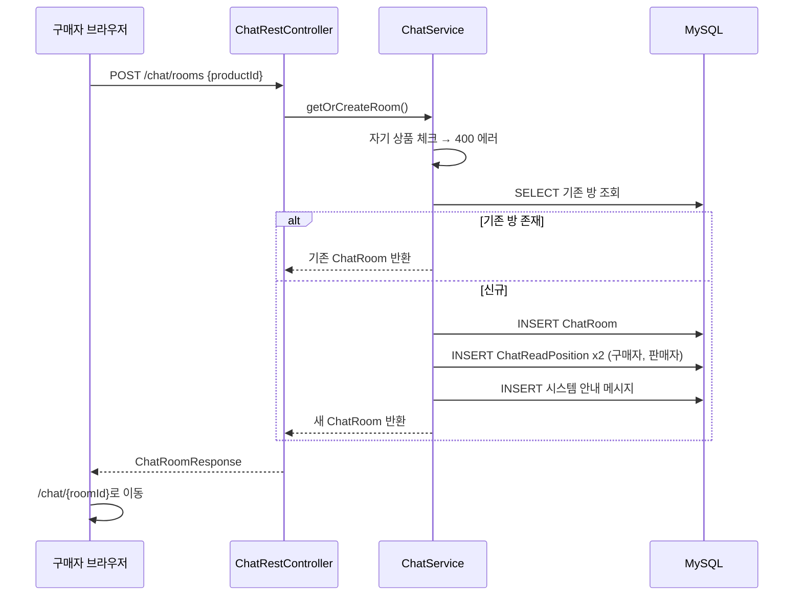
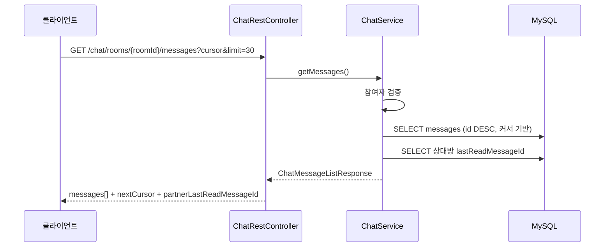
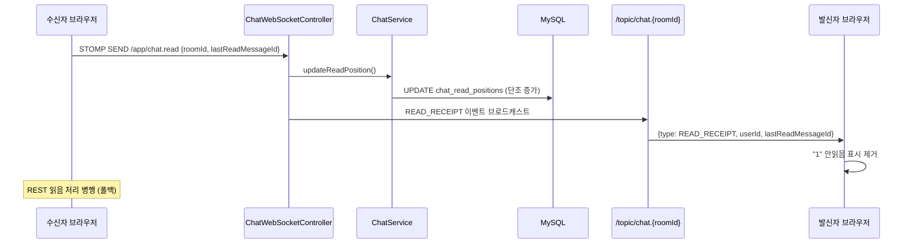
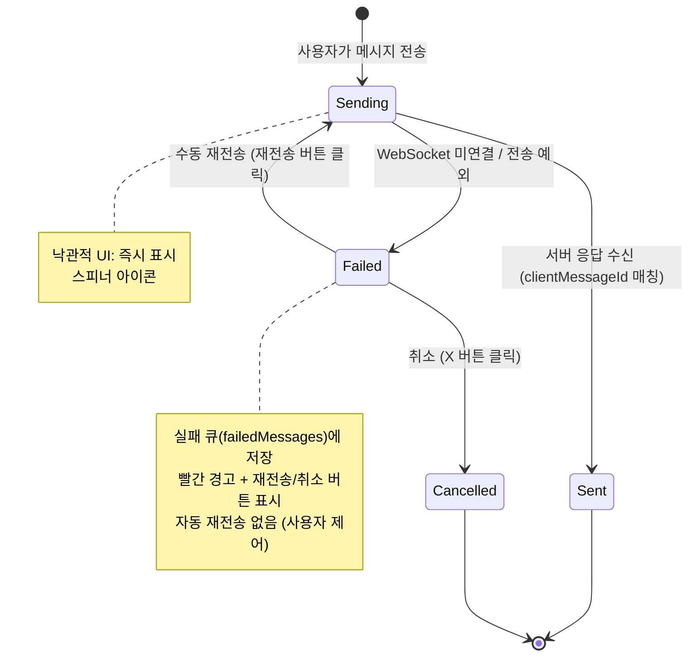
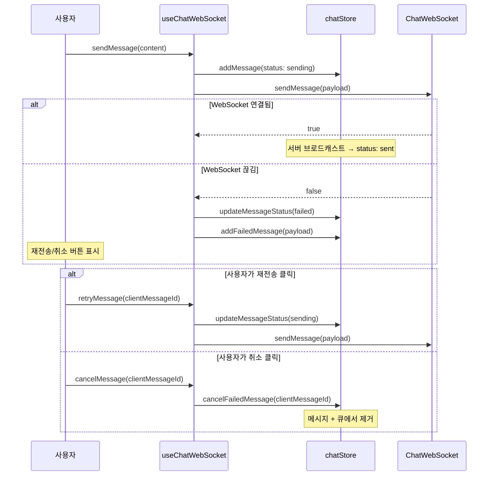
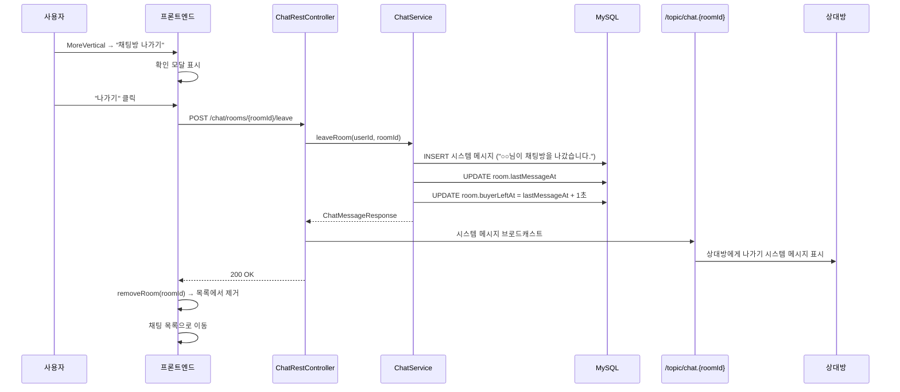
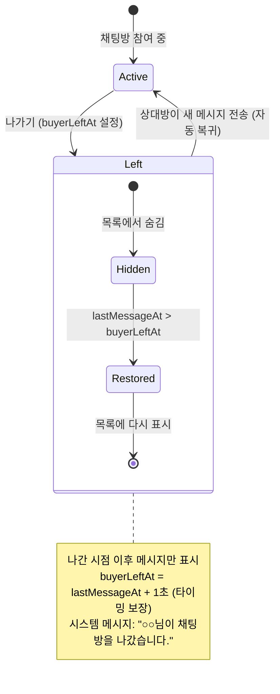

# 채팅 도메인 아키텍처

- **Phase**: 6
- **상태**: 코어 완료

---

## 1. 개요

Cherry 플랫폼의 1:1 실시간 채팅 시스템. 구매자와 판매자가 상품 기반으로 대화할 수 있다.

**핵심 제약:**
- 1:1 채팅만 지원 (그룹 채팅 없음)
- 상품 1개당 구매자-판매자 쌍은 1개의 채팅방만 존재
- 텍스트 메시지만 지원 (이미지 메시지는 타입만 정의, 미구현)

---

## 2. 기술 스택

| 구성 요소 | 기술 | 역할 |
|-----------|------|------|
| 실시간 통신 | STOMP over WebSocket (native, SockJS 미사용) | 메시지 송수신, 읽음 처리 |
| REST API | Spring MVC | 채팅방 생성/조회, 메시지 히스토리, 안읽음 카운트 |
| 메시지 브로커 | SimpleBroker (인메모리) | 토픽 구독/발행 |
| 인증 | JWT (STOMP CONNECT 헤더) | WebSocket 연결 인증 |
| Rate Limit | Redis | 메시지 전송 빈도 제한 |
| XSS 방지 | jsoup | HTML 태그 전부 제거 |
| 프론트엔드 | @stomp/stompjs + Zustand | STOMP 클라이언트 + 상태 관리 |

---

## 3. 데이터 모델

```
chat_rooms
├── id (PK, BIGINT AUTO_INCREMENT)
├── product_id (FK → products)
├── buyer_id (FK → users)
├── seller_id (FK → users)
├── last_message_at (DATETIME)
├── buyer_left_at (DATETIME, nullable)   <- 구매자 나가기 시점
├── seller_left_at (DATETIME, nullable)  <- 판매자 나가기 시점
├── created_at / updated_at
└── UNIQUE(product_id, buyer_id)

chat_messages
├── id (PK, BIGINT AUTO_INCREMENT)
├── chat_room_id (FK → chat_rooms)
├── sender_id (FK → users)
├── message_type (ENUM: TEXT, IMAGE, SYSTEM)
├── content (TEXT, max 1000자)
├── client_message_id (VARCHAR, 멱등성 키)
├── created_at
└── UNIQUE(chat_room_id, client_message_id)

chat_read_positions
├── id (PK, BIGINT AUTO_INCREMENT)
├── chat_room_id (FK → chat_rooms)
├── user_id (FK → users)
├── last_read_message_id (BIGINT)
└── UNIQUE(chat_room_id, user_id)
```

---

## 4. 메시지 흐름

### 4.1 메시지 전송 (실시간)



### 4.2 채팅방 생성



### 4.3 메시지 히스토리 조회



### 4.4 읽음 처리 + 실시간 알림



### 4.5 메시지 전송 실패 및 재전송





### 4.6 채팅방 나가기





**정책:**
- 나간 시점 이후 메시지만 표시 (이전 히스토리 숨김)
- 상대방이 새 메시지를 보내면 자동 복귀 (목록에 다시 노출)
- 시스템 메시지로 상대방에게 나가기 알림
- `buyerLeftAt = lastMessageAt + 1초`로 타이밍 보장 (MySQL datetime(0) 초 단위 비교)

---

## 5. 보안 계층

| 계층 | 검증 내용 | 실패 시 |
|------|----------|---------|
| WebSocket CONNECT | JWT 유효성 검증 | 연결 거부 |
| STOMP SUBSCRIBE | 인증 여부 + 채팅방 참여자 검증 | 구독 거부 |
| STOMP SEND (chat.send) | 참여자 검증 (서비스 레벨) | 에러 메시지 반환 |
| REST API | JWT 인증 + 참여자 검증 | 401/403 |
| 메시지 내용 | jsoup HTML 제거 + 제어문자 제거 + 길이 검증 | 400 |
| 전송 빈도 | Redis Rate Limit | 429 |
| 에러 메시지 | 비즈니스 예외만 반환, 내부 스택 미노출 | 일반 메시지 |

### Room ID 보안 참고

현재 Room ID는 `BIGINT AUTO_INCREMENT`로 순차 증가하여 추측 가능하다. 그러나 REST + WebSocket 양쪽 모두 참여자 검증이 적용되어 있어 비참여자 접근은 차단된다. 향후 외부 노출용 UUID 컬럼 추가를 고려할 수 있다.

---

## 6. 프론트엔드 아키텍처

### 6.1 구성

```
features/chat/
├── api/chatApi.ts           # REST API 래퍼
├── services/ChatWebSocket.ts # STOMP 싱글톤 클라이언트
├── store/chatStore.ts        # Zustand 스토어 (rooms, messages, connectionStatus)
├── hooks/useChatWebSocket.ts # 연결/구독/전송 훅
├── types.ts                  # TypeScript 인터페이스
├── constants.ts              # 필터 상수
├── components/               # ChatBubble, ChatInput, ConnectionStatus, ProductCard
└── pages/ChatDetail.tsx      # 채팅 상세 페이지
```

### 6.2 낙관적 UI 업데이트 + 메시지 큐잉

1. 사용자가 메시지 전송
2. `clientMessageId` (UUID) 생성
3. 임시 메시지를 즉시 UI에 추가 (id: 음수, `status: 'sending'`)
4. STOMP으로 서버 전송 시도
   - **성공**: 서버 브로드캐스트로 임시 메시지 교체 (`status: 'sent'`)
   - **실패**: `status: 'failed'`, `failedMessages` 큐에 저장
5. 실패 메시지: 빨간 경고 아이콘 + 재전송 버튼 + 취소(X) 버튼
6. 사용자가 재전송 버튼 클릭 시 수동 재전송 (자동 재전송 없음)
7. 사용자가 취소 버튼 클릭 시 메시지 + 큐에서 완전 제거
8. `clientMessageId`로 중복 방지 (서버 멱등성)

### 6.3 WebSocket 연결 관리

- `ChatWebSocketService`는 싱글톤 (탭당 1개 연결)
- 자동 재연결 (설정된 간격으로 재시도)
- 하트비트: 양방향
- `connected` 속성으로 STOMP 핸드셰이크 완료 여부 확인 후 publish

---

## 7. 설계 결정 요약

| 결정 | 선택 | 근거 | ADR |
|------|------|------|-----|
| 메시지 저장 방식 | 동기 DB 저장 | MVP 규모, 추가 인프라 비용 없음 | [ADR-005](../decisions/ADR-005-chat-message-storage.md) |
| 채팅 목록 갱신 | WebSocket 푸시 | 이미 WebSocket 인프라 존재, 폴링 대비 효율적 | [ADR-006](../decisions/ADR-006-chat-list-realtime-update.md) |
| 메시지 브로커 | SimpleBroker (인메모리) | 단일 서버 구성, 외부 브로커 비용 불필요 | - |
| SockJS 미사용 | Native WebSocket only | 모던 브라우저 대상, 폴백 불필요 | - |
| Room ID | AUTO_INCREMENT (UUID 아님) | 접근 제어로 충분, DB 성능 우선 | - |
| 실패 메시지 저장소 | IndexedDB (localForage) | 웹/PWA/Electron 호환, 비동기, 플랫폼 교체 용이 | [ADR-007](../decisions/ADR-007-failed-message-storage.md) |
| 채팅 이미지 | MVP 미도입, 향후 thumb+view | 비용/보안 리스크 우선, 사용자 피드백 후 도입 | [ADR-008](../decisions/ADR-008-chat-image-strategy.md) |

---

## 8. 확장 포인트

현재 구현에서 향후 확장 가능한 지점:

| 항목 | 현재 | 확장 시 |
|------|------|---------|
| 메시지 브로커 | SimpleBroker | RabbitMQ/Redis Pub-Sub (다중 서버) |
| 메시지 저장 | 동기 DB INSERT | MQ 기반 비동기 배치 (초당 수천 건 이상 시) |
| Room ID | AUTO_INCREMENT | 외부 노출용 UUID 컬럼 추가 |
| 오프라인 큐잉 | IndexedDB (localForage) 영구 저장 | React Native MMKV 등 플랫폼별 교체 |
| 채팅방 나가기 | leftAt 기반 숨김 + 자동 복귀 | 차단/신고 기능 확장 |
| 이미지 메시지 | 타입만 정의 | thumb+view 구조 S3 업로드 연동 |
| 채팅 검색 | 미구현 | Elasticsearch 연동 |
| 푸시 알림 | 미구현 | FCM/APNs 연동 |
