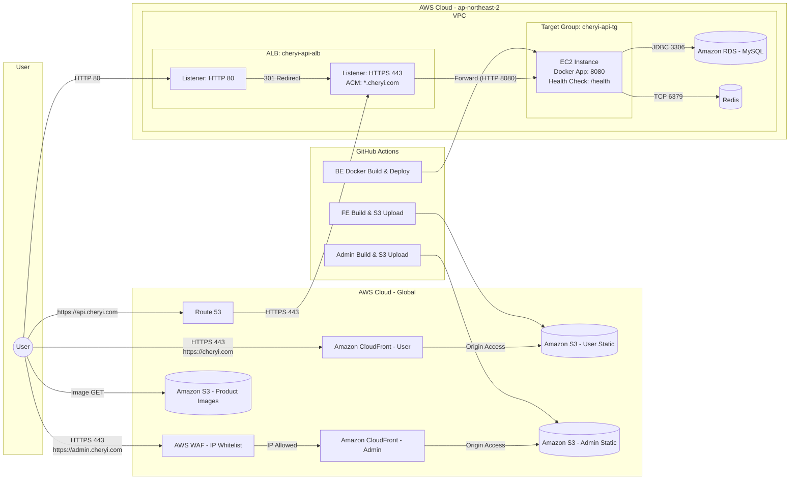

# CI/CD & Runtime Architecture (Frontend + Backend)

---

## 배포 구조 설명

### Frontend (React + Vite)

| 단계 | 도구 | 동작 |
|------|------|------|
| 빌드 | GitHub Actions | `npm run build` → 정적 파일 생성 |
| 업로드 | AWS CLI | S3 Static 버킷에 업로드 |
| 서빙 | CloudFront | S3를 Origin으로 CDN 서빙 |
| 도메인 | Route 53 | `cheryi.com` → CloudFront 연결 |

**특징:**
- Vite 빌드 결과를 S3에 직접 업로드 (서버 불필요)
- CloudFront로 글로벌 CDN 서빙 (Edge Location 캐싱)
- HTTPS는 CloudFront에서 ACM 인증서로 처리

### Admin Frontend (React + Vite)

| 단계 | 도구 | 동작 |
|------|------|------|
| 빌드 | GitHub Actions | `npm run build` → 정적 파일 생성 |
| 업로드 | AWS CLI | S3 Admin 버킷에 업로드 |
| 서빙 | CloudFront | S3를 Origin으로 CDN 서빙 |
| 보안 | AWS WAF | IP 화이트리스트로 접근 제한 |
| 도메인 | Route 53 | `admin.cheryi.com` → CloudFront 연결 |

**특징:**
- 사용자 앱과 물리적으로 완전 분리 (별도 S3, 별도 CloudFront)
- AWS WAF IP 화이트리스트로 네트워크 레벨 접근 제어
- 데스크톱 전용 레이아웃 (관리자 대시보드)

### Backend (Spring Boot + Docker)

| 단계 | 도구 | 동작 |
|------|------|------|
| 빌드 | GitHub Actions | `./gradlew build` → JAR 생성 → Docker 이미지 빌드 |
| 레지스트리 | GHCR | Docker 이미지 Push (GitHub Container Registry) |
| 배포 | SSH + Docker Compose | EC2에서 이미지 Pull → 컨테이너 재시작 |
| 서빙 | ALB | HTTPS 443 → EC2 HTTP 8080 포워딩 |
| 도메인 | Route 53 | `api.cheryi.com` → ALB 연결 |

**특징:**
- Docker Compose로 Spring Boot 앱 + Redis 컨테이너 관리
- ALB에서 HTTPS 종료 (ACM 인증서, `*.cheryi.com`)
- HTTP 80 → HTTPS 443 자동 리다이렉트
- Health Check: `/health` 엔드포인트

## 인프라 구성

### 네트워크

| 구성 요소 | 역할 |
|-----------|------|
| **Route 53** | DNS 관리 (`cheryi.com`, `api.cheryi.com`, `admin.cheryi.com`) |
| **CloudFront** | 프론트엔드 CDN + HTTPS (User / Admin 각각 별도 배포) |
| **AWS WAF** | 관리자 앱 IP 화이트리스트 접근 제한 |
| **ALB** | 백엔드 로드밸런서 + HTTPS 종료 |
| **VPC** | 백엔드 인프라 격리 (ap-northeast-2) |

### 컴퓨팅 및 스토리지

| 구성 요소 | 역할 | 비고 |
|-----------|------|------|
| **EC2** | Spring Boot 앱 실행 | Docker Compose 기반 |
| **RDS MySQL** | 관계형 데이터 저장 | VPC 내부, JDBC 3306 |
| **Redis** | 캐싱 + Rate Limit + 트렌딩 | Docker 컨테이너, TCP 6379 |
| **S3 Static (User)** | 사용자 프론트엔드 정적 파일 | CloudFront Origin |
| **S3 Static (Admin)** | 관리자 프론트엔드 정적 파일 | CloudFront Origin + WAF |
| **S3 Media** | 상품 이미지 저장 | Presigned URL 업로드, Lambda 리사이즈 |

### 보안

- ALB에서 HTTPS 종료 (ACM 인증서)
- Frontend/Backend 다른 Origin → CORS 정책 적용
- 원본 이미지 경로 비공개, 리사이즈 결과만 공개
- VPC 내부 통신 (EC2 ↔ RDS, EC2 ↔ Redis)
