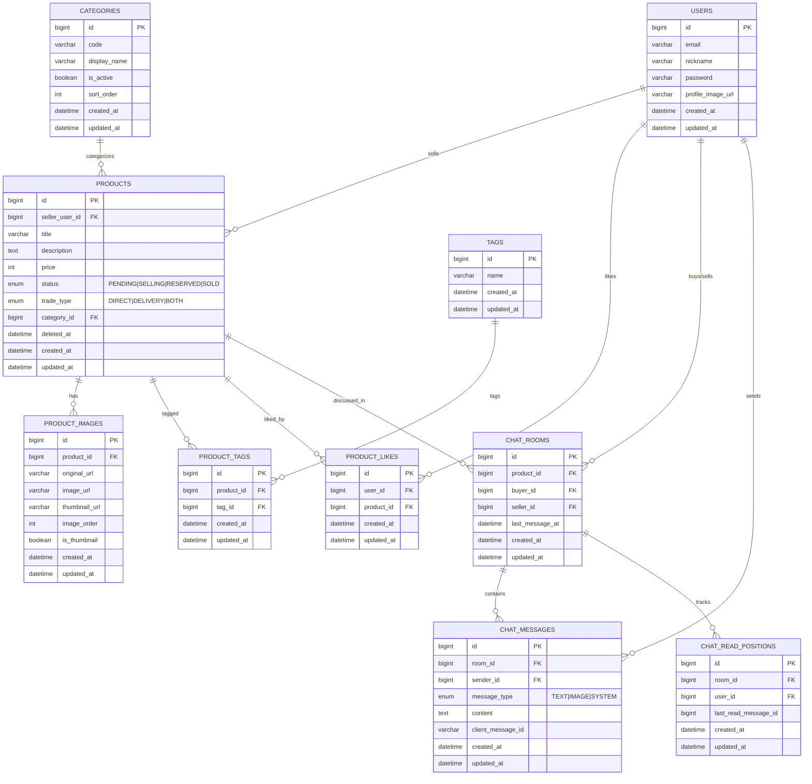

# ERD

```mermaid
erDiagram
  USERS ||--o{ PRODUCTS : sells
  CATEGORIES ||--o{ PRODUCTS : categorizes
  PRODUCTS ||--o{ PRODUCT_IMAGES : has
  PRODUCTS ||--o{ PRODUCT_TAGS : tagged
  TAGS ||--o{ PRODUCT_TAGS : tags
  USERS ||--o{ PRODUCT_LIKES : likes
  PRODUCTS ||--o{ PRODUCT_LIKES : liked_by
  PRODUCTS ||--o{ CHAT_ROOMS : discussed_in
  USERS ||--o{ CHAT_ROOMS : "buys/sells"
  CHAT_ROOMS ||--o{ CHAT_MESSAGES : contains
  USERS ||--o{ CHAT_MESSAGES : sends
  CHAT_ROOMS ||--o{ CHAT_READ_POSITIONS : tracks

  USERS {
    bigint id PK
    varchar email
    varchar nickname
    varchar password
    varchar profile_image_url
    datetime created_at
    datetime updated_at
  }

  CATEGORIES {
    bigint id PK
    varchar code
    varchar display_name
    boolean is_active
    int sort_order
    datetime created_at
    datetime updated_at
  }

  PRODUCTS {
    bigint id PK
    bigint seller_user_id FK
    varchar title
    text description
    int price
    enum status "PENDING|SELLING|RESERVED|SOLD"
    enum trade_type "DIRECT|DELIVERY|BOTH"
    bigint category_id FK
    datetime deleted_at
    datetime created_at
    datetime updated_at
  }

  PRODUCT_IMAGES {
    bigint id PK
    bigint product_id FK
    varchar original_url
    varchar image_url
    varchar thumbnail_url
    int image_order
    boolean is_thumbnail
    datetime created_at
    datetime updated_at
  }

  TAGS {
    bigint id PK
    varchar name
    datetime created_at
    datetime updated_at
  }

  PRODUCT_TAGS {
    bigint id PK
    bigint product_id FK
    bigint tag_id FK
    datetime created_at
    datetime updated_at
  }

  PRODUCT_LIKES {
    bigint id PK
    bigint user_id FK
    bigint product_id FK
    datetime created_at
    datetime updated_at
  }

  CHAT_ROOMS {
    bigint id PK
    bigint product_id FK
    bigint buyer_id FK
    bigint seller_id FK
    datetime last_message_at
    datetime created_at
    datetime updated_at
  }

  CHAT_MESSAGES {
    bigint id PK
    bigint room_id FK
    bigint sender_id FK
    enum message_type "TEXT|IMAGE|SYSTEM"
    text content
    varchar client_message_id
    datetime created_at
    datetime updated_at
  }

  CHAT_READ_POSITIONS {
    bigint id PK
    bigint room_id FK
    bigint user_id FK
    bigint last_read_message_id
    datetime created_at
    datetime updated_at
  }
```
