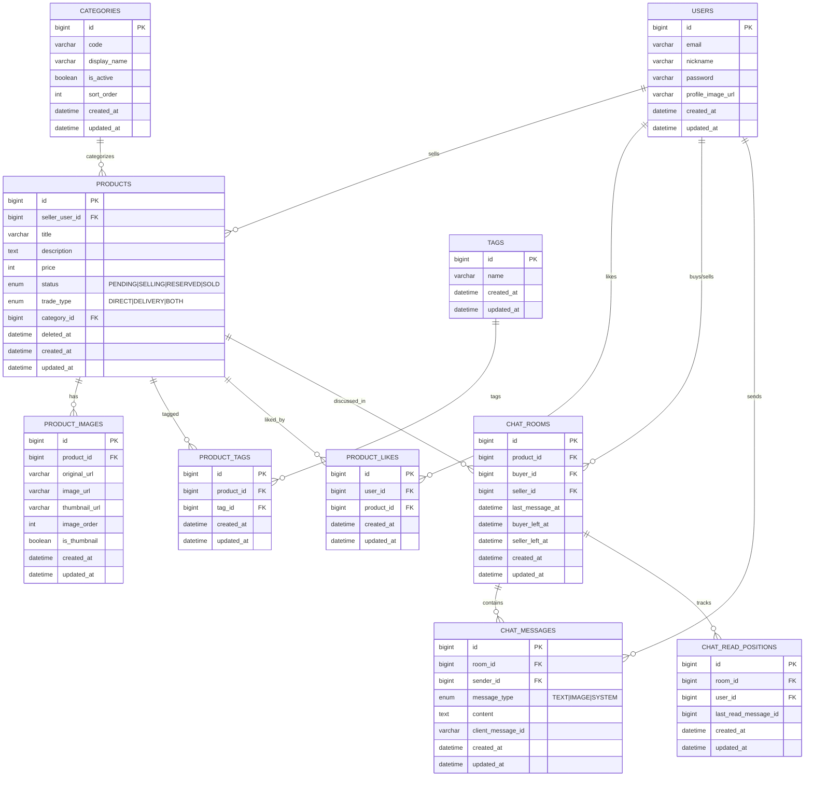

# ERD

---

## 테이블 설명

### 사용자 및 인증

| 테이블 | 역할 | 비고 |
|--------|------|------|
| **USERS** | 회원 정보 (이메일, 닉네임, BCrypt 비밀번호) | email/nickname UNIQUE |

### 상품

| 테이블 | 역할 | 비고 |
|--------|------|------|
| **PRODUCTS** | 상품 정보 (제목, 설명, 가격, 상태, 거래방식) | Soft Delete (`deleted_at`), 상태: PENDING→SELLING→RESERVED→SOLD |
| **CATEGORIES** | 상품 카테고리 마스터 (포토카드, 앨범 등) | `code`로 필터링, `sort_order`로 정렬 |
| **PRODUCT_IMAGES** | 상품 이미지 (원본/리사이즈/썸네일 URL) | Lambda 처리 전 `image_url=null`, `is_thumbnail`로 대표 이미지 지정 |
| **TAGS** | 태그 마스터 (상품 등록 시 자동 생성) | name UNIQUE |
| **PRODUCT_TAGS** | 상품-태그 N:M 매핑 | |
| **PRODUCT_LIKES** | 찜(위시) 기록 | `UNIQUE(user_id, product_id)` 중복 방지 |

### 채팅

| 테이블 | 역할 | 비고 |
|--------|------|------|
| **CHAT_ROOMS** | 1:1 채팅방 (상품 기반) | `UNIQUE(product_id, buyer_id)`, `buyer_left_at`/`seller_left_at`으로 나가기 관리 |
| **CHAT_MESSAGES** | 채팅 메시지 (TEXT/IMAGE/SYSTEM) | `UNIQUE(room_id, client_message_id)` 멱등성 보장 |
| **CHAT_READ_POSITIONS** | 읽음 위치 추적 | `last_read_message_id` 단조 증가 |

## 주요 관계

- **1:N** — USERS → PRODUCTS (판매자), PRODUCTS → PRODUCT_IMAGES, CHAT_ROOMS → CHAT_MESSAGES
- **N:M** — PRODUCTS ↔ TAGS (PRODUCT_TAGS 중간 테이블)
- **1:1 (논리적)** — CHAT_ROOMS는 `UNIQUE(product_id, buyer_id)`로 상품-구매자 쌍당 1개 채팅방

## 설계 특징

- 모든 테이블에 `created_at`/`updated_at` 존재 (`BaseTimeEntity` 상속)
- PRODUCTS의 `deleted_at`으로 Soft Delete 구현 (30일 유예 후 물리 삭제)
- ENUM 타입은 MySQL ENUM으로 매핑 (`@Enumerated(STRING)`)
- AUTO_INCREMENT BIGINT PK 사용 (UUID 미사용, 성능 우선)
