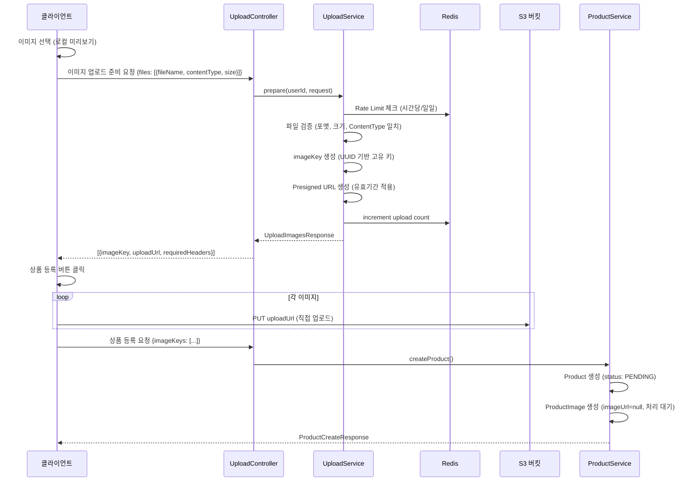
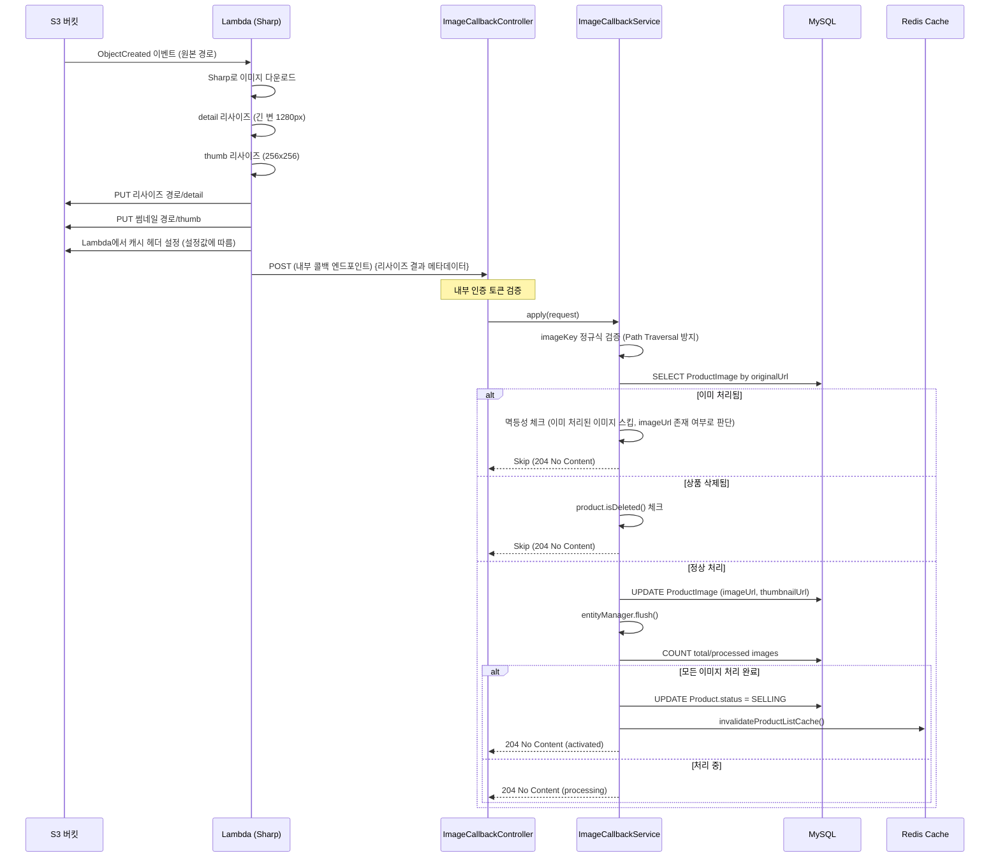
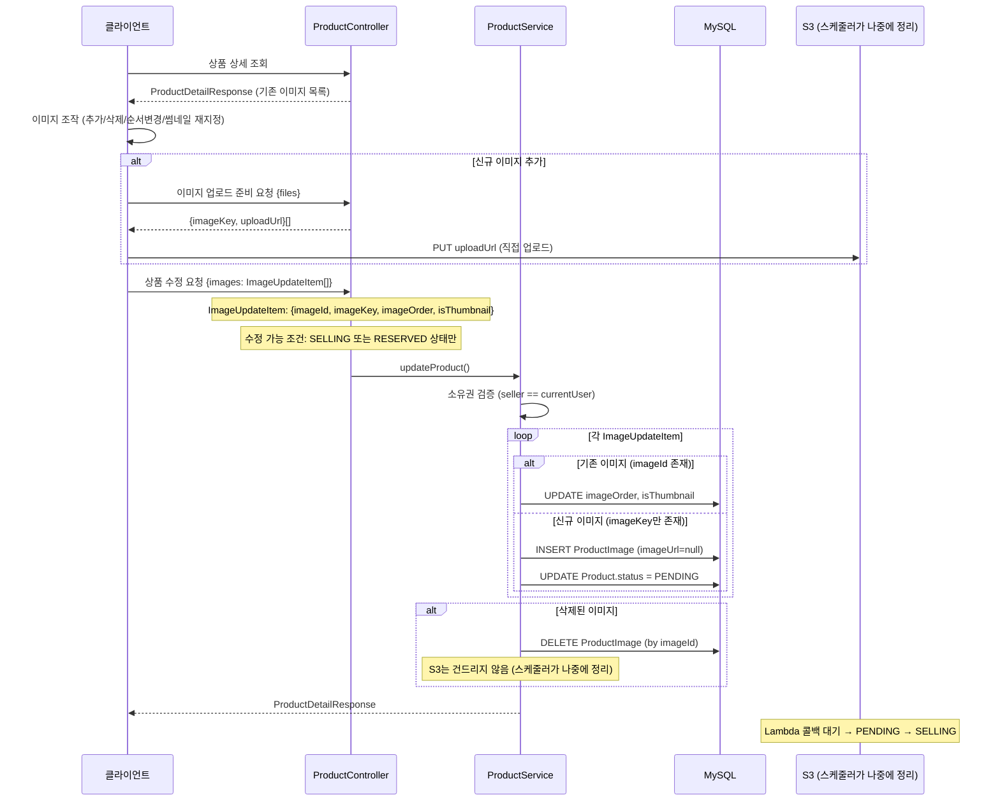
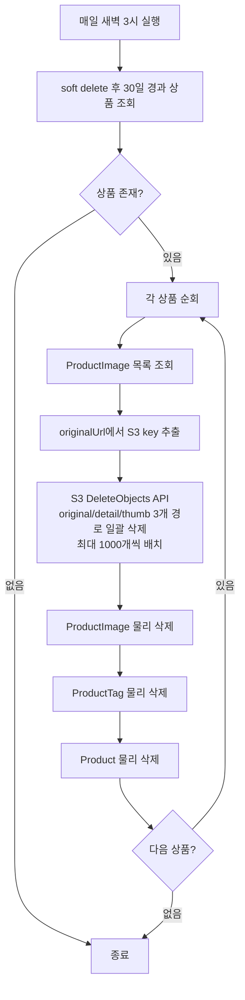
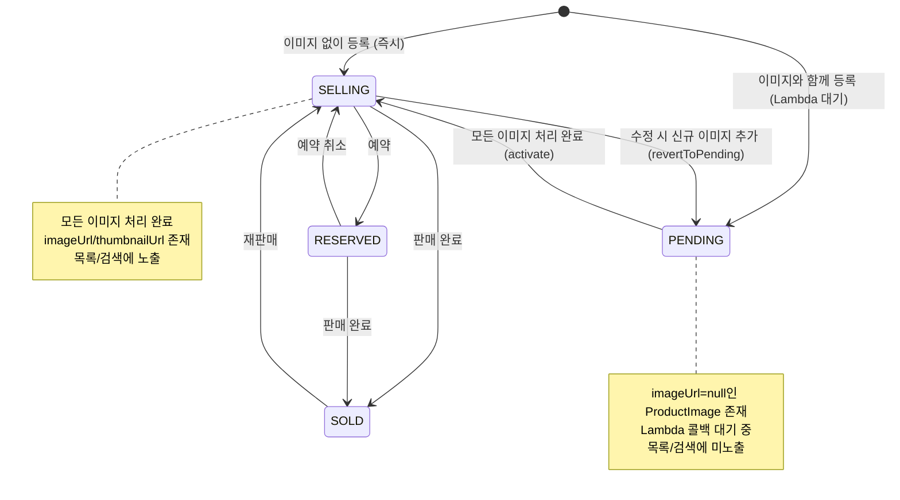

# 이미지 업로드 파이프라인 아키텍처

- **Phase**: 5
- **상태**: 완료

---

## 1. 개요

Presigned URL 기반 클라이언트 직접 업로드 + Lambda 자동 리사이즈 파이프라인. 서버 대역폭을 사용하지 않고, 이벤트 기반으로 이미지를 자동 처리한다.

**핵심 제약:**
- 허용 포맷: JPG/JPEG, PNG, WebP
- 최대 파일 크기: 10MB
- 상품당 최대 10장
- Lazy Upload: 상품 등록 시점에 한 번에 업로드

---

## 2. 기술 스택

| 구성 요소 | 기술 | 역할 |
|-----------|------|------|
| 업로드 | S3 Presigned URL (PUT) | 클라이언트 직접 업로드 |
| 리사이즈 | AWS Lambda (Sharp) | detail(1280px) + thumb(256x256) 자동 생성 |
| 콜백 | HTTP POST (Lambda → Backend) | 메타데이터 동기화 |
| 인증 | 내부 인증 토큰 (헤더) | Lambda 콜백 검증 |
| Rate Limit | Redis | 업로드 빈도 제한 |
| 정리 | Spring @Scheduled | 고아 이미지 배치 삭제 |
| CDN | CloudFront | 리사이즈 이미지 서빙 |

---

## 3. 데이터 모델

```
product_images
├── id (PK, BIGINT AUTO_INCREMENT)
├── product_id (FK → products)
├── original_url (VARCHAR, S3 원본 URL)
├── image_url (VARCHAR, detail 리사이즈 URL)
├── thumbnail_url (VARCHAR, thumb 리사이즈 URL)
├── image_order (INT, 순서)
├── is_thumbnail (BOOLEAN, 대표 이미지(썸네일) 여부)
├── created_at / updated_at
└── INDEX(product_id), INDEX(product_id, is_thumbnail), INDEX(product_id, image_order)

imageKey 포맷: UUID 기반 고유 키 (순서 정보 포함)
```

---

## 4. 파이프라인 흐름

### 4.1 상품 등록 시 이미지 업로드



### 4.2 Lambda 리사이즈 + 콜백



### 4.3 상품 수정 시 이미지 처리



### 4.4 S3 배치 정리 (스케줄러)



**동작 방식:**
- `deleted_at <= NOW() - 30일` 조건으로 만료 상품 조회
- 각 상품의 ProductImage에서 originalUrl 추출
- S3 key 규칙: originalUrl에서 키 추출 → 리사이즈/썸네일 경로 파생
- S3 DeleteObjects API로 최대 1,000개씩 일괄 삭제 (원본/detail/thumb 3개 × N장)
- DB 물리 삭제 순서: ProductImage → ProductTag → Product (FK 제약)

### 4.5 상태 전환



---

## 5. 보안

| 위험 | 완화 방안 |
|------|----------|
| 비인가 업로드 | Presigned URL Rate Limiting (Redis 기반) |
| 파일 크기 폭탄 | Content-Length 강제, 10MB 제한 |
| 악성 파일 | 포맷 화이트리스트 (JPG/JPEG/PNG/WebP) + ContentType 일치 검증 |
| Lambda 콜백 위조 | 내부 인증 토큰 헤더 검증 |
| imageKey 경로 탐색 | 정규식 검증 (Path Traversal 방지) |
| 스토리지 누적 | 배치 스케줄러 (30일 유예 후 물리 삭제) |
| 소유권 위반 | 수정 시 imageId 소유권 검증 (seller == currentUser) |

---

## 6. 프론트엔드

### 6.1 구성

- `ProductWrite.tsx` — 이미지 선택 → 로컬 미리보기 → 등록 시 업로드
- `ProductEdit.tsx` — 이미지 추가/삭제/순서변경/썸네일 재지정

### 6.2 Lazy Upload 전략

**왜 Lazy Upload인가?**
- 이미지 선택 시 즉시 업로드하지 않음
- 로컬 미리보기만 표시 (`URL.createObjectURL`)
- 상품 등록 버튼 클릭 시 한 번에 업로드

**장점:**
- 고아 이미지 방지 (사용자가 등록 취소 시 S3에 업로드 안 됨)
- 올바른 `imageOrder` 인덱싱 (최종 순서로 업로드)
- UX 개선 (선택 즉시 미리보기 가능)

**흐름:**
1. 사용자 이미지 선택 → 로컬 Blob URL로 미리보기
2. 이미지 선택 순서에 따라 자동 배치
3. 등록 버튼 클릭 → Presigned URL 요청
4. S3에 순차 업로드 → 상품 생성 요청

---

## 7. 설계 결정 요약

| 결정 | 선택 | 근거 | ADR |
|------|------|------|-----|
| 업로드 방식 | Presigned URL 직접 업로드 | 서버 대역폭 절약, 확장성 | - |
| 리사이즈 | Lambda 비동기 | 이벤트 기반, 서버 부하 없음 | - |
| 이미지 수정 범위 | 완전 편집 (추가/삭제/순서/썸네일) | 당근마켓 수준 UX | [ADR-002](../decisions/ADR-002-image-edit-scope.md) |
| 배치 정리 | 매일 1회 스케줄러 | 즉시 삭제 불필요, 유예기간 확보 | [ADR-004](../decisions/ADR-004-s3-image-cleanup.md) |
| PENDING 상태 | 이미지 처리 중 비공개 | 미완성 상품 노출 방지 | - |

---

## 8. 확장 포인트

현재 구현에서 향후 확장 가능한 지점:

| 항목 | 현재 | 확장 시 |
|------|------|---------|
| 리사이즈 크기 | detail(1280px) + thumb(256x256) | 반응형 다중 크기 (480/720/1080/1440) |
| 포맷 | JPEG 출력 고정 | WebP/AVIF 자동 변환 (브라우저별 대응) |
| 채팅 이미지 | 미구현 | thumb(150px) + view(1600px) 구조 |
| 스토리지 클래스 | Standard | Lifecycle으로 IA/Glacier 전환 |
| CDN | CloudFront | 지역별 Edge Location 최적화 |
| Rate Limit | Redis 카운터 | Token Bucket 알고리즘 |
