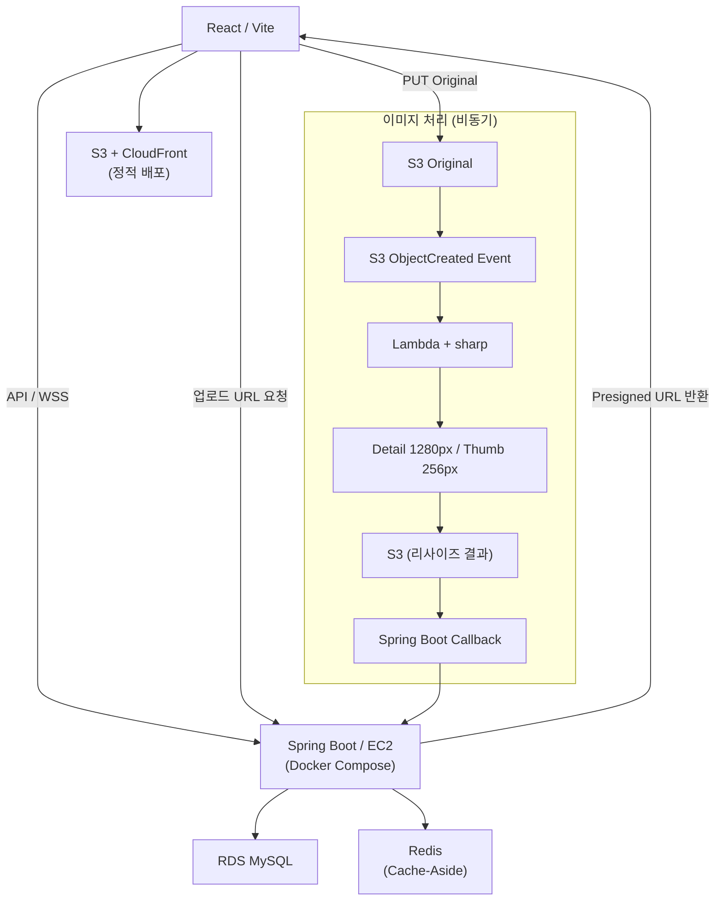
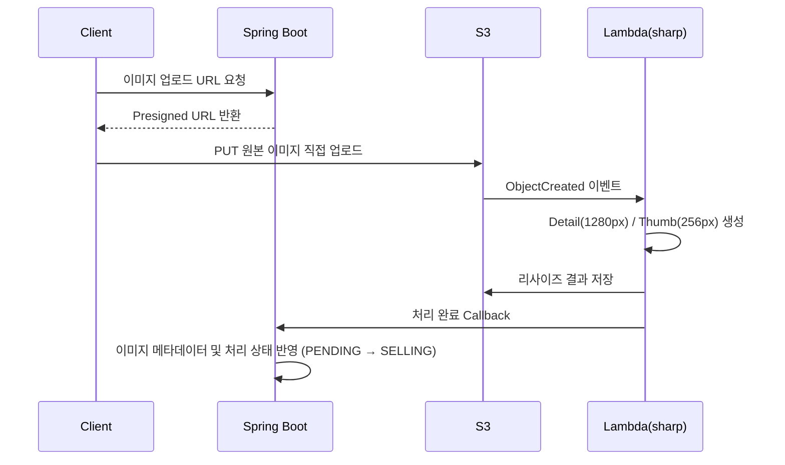
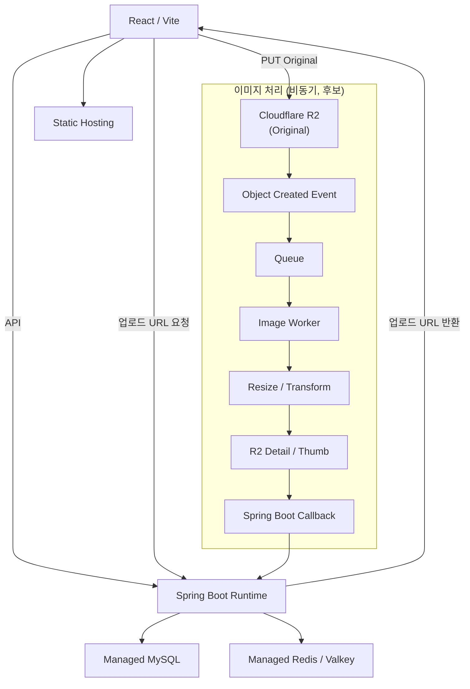
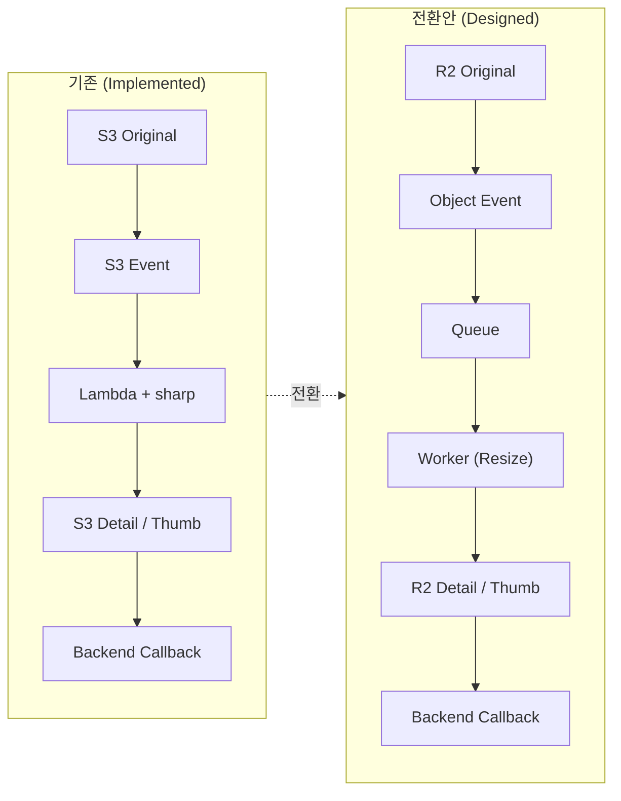

# 저비용 인프라 전환 설계

> 기존 AWS 인프라의 설계 특성을 유지하면서 운영 비용을 낮추기 위한 전환 기준과 후보 구조를 정리한다.

---

## 1. 개요

이 문서는 "서비스를 다시 배포했다"는 결과 보고가 아니라, **기존 설계 의도를 유지하면서 인프라 비용을 최소화하도록 다시 구성하는 방법을 고민·설계한 기록**이다.

- 기존 AWS 무료 계정 종료로 공개 배포가 중단되면서, 같은 서비스를 더 낮은 비용으로 다시 올리는 방법을 검토했다.
- 기존 데이터 계층과 이미지 처리 구조의 설계 의도는 유지하면서, 비용이 큰 인프라 구성 요소를 저비용 대안으로 전환한다.
- 예상 사용량과 트래픽을 기준으로, 과도한 상시 리소스를 두지 않고 운영 비용을 최소화하는 방향으로 설계한다.
- 아래 전환 후보 구조는 설계 단계이며 실제 이전은 아직 진행하지 않았다 (구현 상태는 [8장](#8-구현-상태-구분) 참조).

관련 기존 문서:

- [System Overview](./system-overview.md) — 기존 AWS 인프라 구성
- [CI/CD + Runtime](./cicd.md) — 기존 배포 파이프라인
- [Image Pipeline Domain](./image-pipeline-domain.md) — 기존 이미지 파이프라인 상세

---

## 2. 현재 상태

기존 AWS 환경은 종료된 상태이며, 동일한 애플리케이션 구조를 유지하면서 인프라를 재구성하는 것을 전제로 한다.

| 항목 | 상태 |
|------|------|
| 기존 AWS 인프라 | 계정 종료로 **내려간 상태** |
| 공개 배포 | **중단** |
| 로컬 실행 | 가능 |
| S3 이미지 자산 | 별도 백업이 없는 경우 이전 대상에서 제외 |

---

## 3. 기존 AWS 구성 *(Implemented in previous AWS version)*

실제로 구현·배포했던 AWS 기반 구조다. 상세는 [System Overview](./system-overview.md), [CI/CD](./cicd.md) 참조.

| 레이어 | 구현 기술 |
|--------|-----------|
| Frontend | React / Vite |
| 정적 배포 | S3 + CloudFront |
| Backend | Spring Boot / EC2 (Docker Compose) |
| DB | RDS MySQL |
| Cache | Redis (Cache-Aside) |
| Image Storage | S3 |
| Image Processing | S3 Event → Lambda(sharp) → 리사이즈 → Callback |

---

## 4. 기존 이미지 처리 흐름 *(Implemented)*

핵심은 **원본 저장과 이미지 후처리를 분리**하고, **업로드 이벤트를 기준으로 비동기 처리**한다는 점이다. 이 구조 덕분에 리사이징 부하가 API 서버와 경쟁하지 않는다.

---

## 5. 전환 원칙 *(Designed)*

전환의 목표는 "AWS 서비스를 1:1로 재현"하는 것이 아니라, **아래 설계 의도를 유지하면서 상시 비용을 최소화**하는 것이다.

| 원칙 | 유지하려는 이유 |
|------|-----------------|
| **MySQL/JPA 구조 유지** | 기존 DB 설계·인덱스·조회 성능 개선 기록과 실제 코드의 일관성 유지 |
| **Cache-Aside 구조 유지** | Redis 또는 호환 가능한 Valkey 계열로 기존 캐시 전략 보존 |
| **이미지 처리를 API 서버와 분리** | 리사이징이 API 서버 CPU/메모리와 경쟁하지 않도록 책임 분리 유지 |
| **비동기 이미지 처리 유지** | Object Storage 이벤트 이후 별도 Worker가 처리하는 구조 유지 |
| **예상 사용량에 맞는 인프라 구성** | 예상 트래픽과 사용량에 비해 과도한 상시 리소스를 두지 않고, 필요한 수준의 인프라만 유지 |

> [!NOTE]
> 각 서비스의 Free Tier·저비용 플랜 조건·제한(용량, 요청 수, 슬립 정책 등)은 시점에 따라 바뀌므로, **실제 이전 시점에 다시 조사한 뒤 확정**해야 한다.

---

## 6. 저비용 전환 후보 구조 *(Designed / Not Implemented)*

| 역할 | 후보 | 전환 방향 |
|------|------|-----------|
| Frontend | Cloudflare Pages / Firebase Hosting 등 정적 호스팅 | React 정적 배포 |
| Backend | Container / Web Runtime | Spring Boot 유지 |
| DB | Managed MySQL | 기존 MySQL/JPA 코드 최대한 유지 |
| Cache | Managed Redis / Valkey | 기존 Cache-Aside 구조 유지 |
| Image Storage | Cloudflare R2 | S3 대체 Object Storage |
| Image Processing | Queue + Worker + Transform | 기존 S3 Event + Lambda 책임 분리 보존 |

> 위 서비스명은 모두 **전환 후보**이며 확정된 선택이 아니다. 각 후보는 Free Tier 또는 저비용 플랜을 우선 검토하되, 실제 이전 시점에 조건을 재조사해 최종 결정한다.

---

## 7. 이미지 파이프라인 전환 방향 *(Designed)*

구현 기술은 바뀌어도 **설계 의도는 그대로 유지**한다. 아래는 기존과 전환안의 구조 비교다.

이 구조를 유지하면 구현 기술이 달라져도 다음 특성이 보존된다.

- 이미지 처리 실패가 일반 API 요청에 직접 영향을 주지 않는다.
- 이미지 리사이징 작업을 별도 실행 환경으로 격리한다.
- 비동기 처리 및 재처리(재시도) 구조로 확장할 수 있다.
- 원본 / Detail / Thumbnail 저장 규칙을 유지할 수 있다.

전환안에서는 기존 `S3 Event → Lambda` 구조와 달리 Queue를 명시적으로 두어 이벤트 발생과 이미지 처리 사이의 속도 차이를 완충하고, 재처리 지점을 분리한다. 구체적인 소비 속도와 재시도 정책은 실제 구현 시점에 Worker 측 정책까지 포함해 결정한다.

---

## 8. 구현 상태 구분

읽는 사람이 "이미 만든 것"과 "앞으로 옮길 설계안"을 혼동하지 않도록 상태를 명확히 구분한다.

| 상태 | 대상 |
|------|------|
| ✅ **Implemented (previous AWS version)** | React/Vite, S3+CloudFront, Spring Boot/EC2, RDS MySQL, Redis, S3 이미지 저장, S3 Event → Lambda(sharp) → 리사이즈 → Callback 파이프라인 |
| 📐 **Designed for low-cost migration** | 전환 원칙, 저비용 후보 구조, 이미지 파이프라인 전환 방향(R2 + Queue + Worker) |
| ⛔ **Not implemented yet** | Static Hosting / Runtime 배포, Managed MySQL·Redis 이전, Cloudflare R2 이전, Queue·Worker 파이프라인 구현 |

---

## 9. 추후 구현 순서 *(Not Implemented)*

1. [ ] 로컬 실행 및 주요 기능 정상 동작 확인
2. [ ] 샘플 데이터와 이미지 자산 재구성
3. [ ] 실제 이전 시점의 Free Tier·저비용 플랜 / 제약 재조사
4. [ ] MySQL 이전 및 Spring Boot 연결
5. [ ] Redis / Valkey 연결
6. [ ] Backend / Frontend 배포
7. [ ] Object Storage(R2) 이전
8. [ ] 이미지 이벤트 → Queue → Worker 파이프라인 구현
9. [ ] 전체 기능 동작 및 엔드포인트 검증

---

## 10. 마무리 메모

이번 전환에서는 기존 기술 스택을 그대로 유지하는 것보다, 기존 구조에서 중요했던 설계 특성을 유지하는 것을 우선한다.

MySQL/JPA 기반 데이터 계층과 Cache-Aside 전략은 기존 코드와 성능 개선 결과를 유지하기 위해 보존하고, 이미지 처리 역시 API 서버와 후처리 작업을 분리한 비동기 구조를 유지한다.

반면 특정 AWS 서비스에 대한 의존은 필수 조건으로 두지 않는다. 현재 사용량과 비용 조건에 맞는 인프라로 대체하되, 기존 구조에서 해결하려 했던 문제와 책임 분리는 유지하는 것이 이번 전환의 기준이다.
