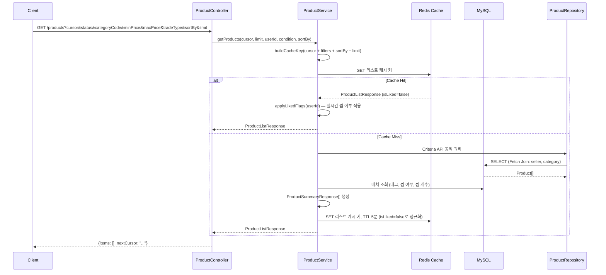
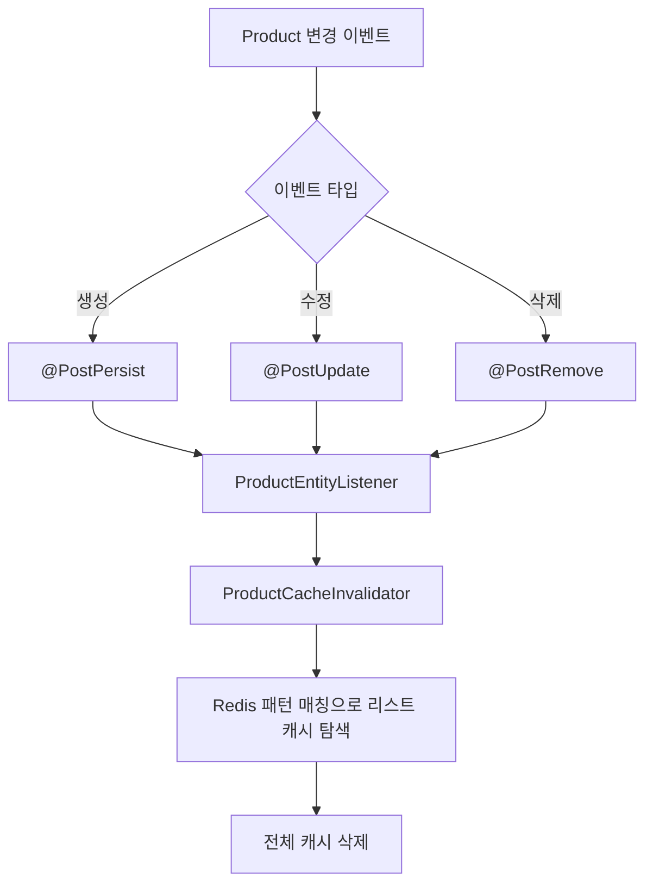
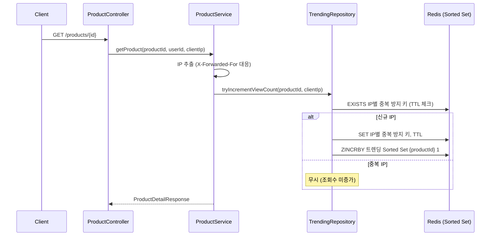
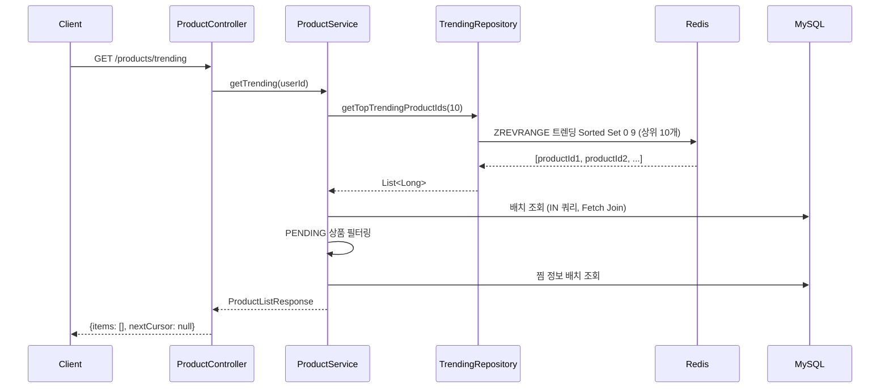
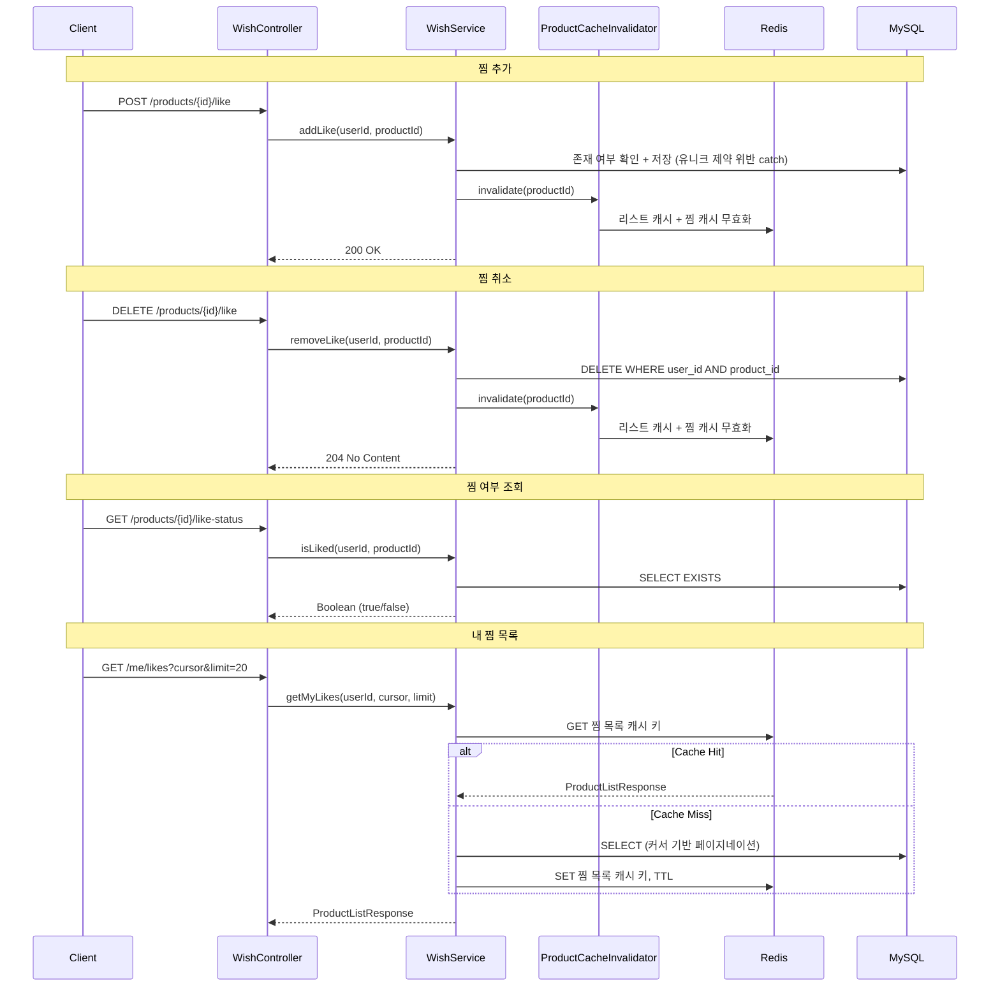
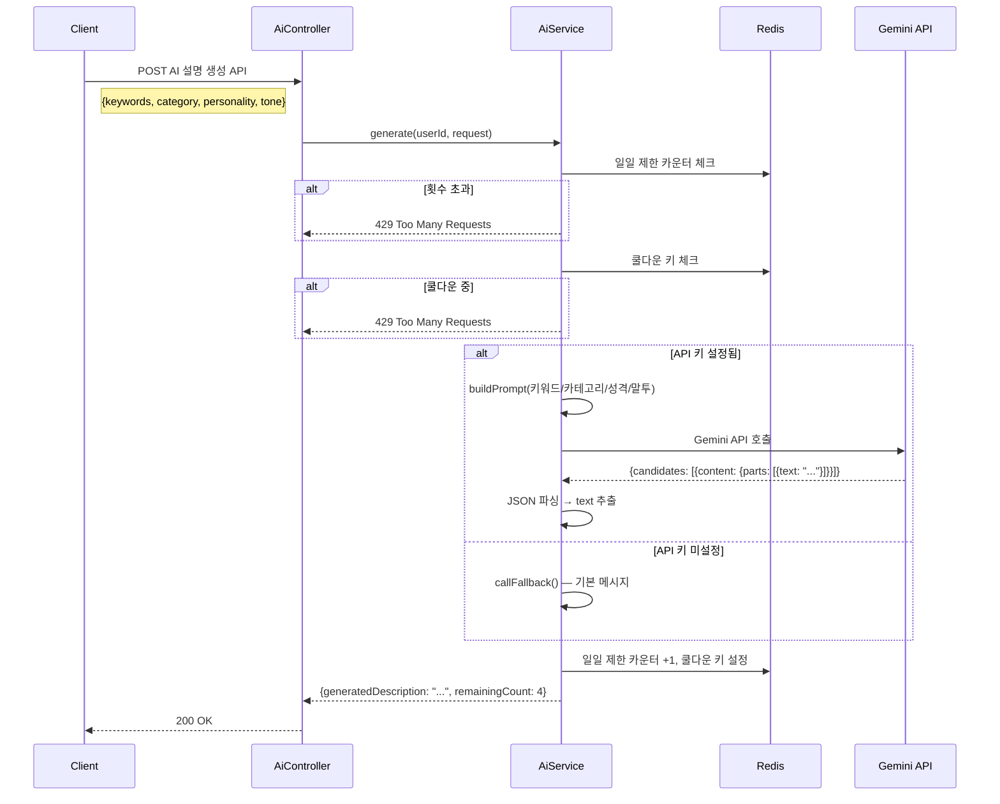
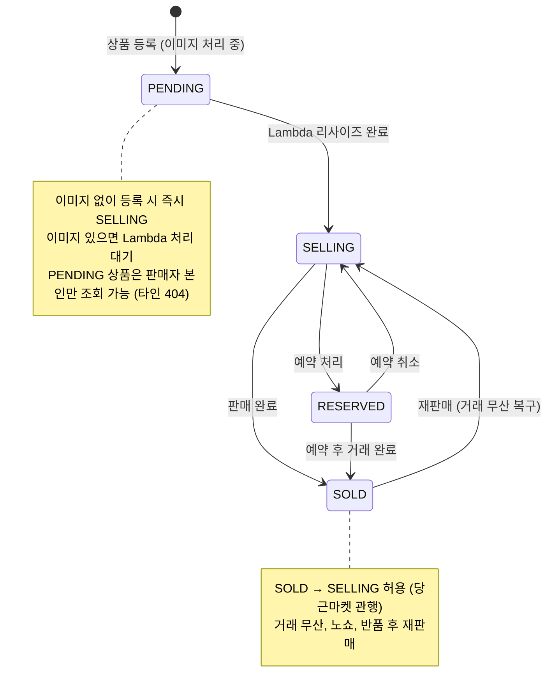

# 상품 도메인 아키텍처

- **Phase**: 2~5
- **상태**: 완료

---

## 1. 개요

Cherry 플랫폼의 핵심 도메인. 상품 등록/수정/삭제, 리스트 조회, 캐싱, 트렌딩, 찜, AI 설명 생성을 포함한다.

**핵심 기능:**
- 상품 CRUD (생성/수정/삭제)
- 동적 필터링 + 커서 기반 페이지네이션
- Redis 캐싱 (Cache-Aside 패턴)
- 트렌딩 시스템 (조회수 기반 랭킹)
- 찜(위시) 기능
- AI 상품 설명 생성 (Gemini)
- 상품 상태 관리 (PENDING → SELLING → RESERVED → SOLD)

---

## 2. 기술 스택

| 구성 요소 | 기술 | 역할 |
|-----------|------|------|
| 동적 쿼리 | JPA Criteria API | 필터 조합 처리 (status, category, price, tradeType) |
| 캐싱 | Redis Cache-Aside | 리스트 조회 성능 최적화 (TTL 5분) |
| 트렌딩 | Redis Sorted Set | 조회수 집계 + 상위 상품 추출 |
| 찜 | 복합 유니크 인덱스 | 중복 방지 (user_id + product_id) |
| AI | Google Gemini API | 상품 설명 자동 생성 |
| 삭제 | Soft Delete (deleted_at) | 데이터 보존 (30일 유예) |
| 상태 관리 | 화이트리스트 맵 | 유효하지 않은 상태 전환 방지 |

---

## 3. 데이터 모델

```
products
├── id (PK, BIGINT AUTO_INCREMENT)
├── seller_user_id (FK → users)
├── title (VARCHAR, NOT NULL)
├── description (TEXT)
├── price (INT)
├── status (ENUM: PENDING, SELLING, RESERVED, SOLD)
├── trade_type (ENUM: DIRECT, DELIVERY, BOTH)
├── category_id (FK → categories)
├── deleted_at (DATETIME, nullable) — Soft Delete
├── created_at / updated_at (DATETIME)

categories
├── id (PK)
├── code (VARCHAR, UNIQUE) — 필터링 키
├── display_name (VARCHAR) — 화면 표시명
├── is_active (BOOLEAN)
├── sort_order (INT)
├── created_at / updated_at

tags
├── id (PK)
├── name (VARCHAR, UNIQUE) — 자동 생성
├── created_at / updated_at

product_tags (N:M)
├── product_id (FK → products)
├── tag_id (FK → tags)

product_likes
├── id (PK)
├── user_id (FK → users)
├── product_id (FK → products)
├── created_at / updated_at
└── UNIQUE(user_id, product_id)

product_images
├── id (PK)
├── product_id (FK → products)
├── original_url (VARCHAR) — S3 원본
├── image_url (VARCHAR) — Lambda 리사이즈 결과
├── thumbnail_url (VARCHAR) — Lambda 썸네일
├── image_order (INT) — 정렬 순서
├── is_thumbnail (BOOLEAN) — 대표 이미지 여부
└── created_at / updated_at
```

---

## 4. 상품 조회 + 캐싱

### 4.1 리스트 조회 흐름



### 4.2 동적 필터링 (Criteria API)

**필터 파라미터:**
- `status` (SELLING, RESERVED, SOLD)
- `categoryCode` (PHOTOCARD, ALBUM, etc.)
- `minPrice` / `maxPrice`
- `tradeType` (DIRECT, DELIVERY, BOTH)
- `sortBy` (LATEST, LOW_PRICE, HIGH_PRICE)

**동적 Predicate 생성:**
- 각 필터가 null이 아닌 경우에만 Predicate 추가
- `TradeType.BOTH` 특수 처리: DIRECT/DELIVERY 요청에도 매칭
- Fetch Join (seller, category)으로 N+1 방지
- 배치 조회로 태그, 찜 여부 N+1 완전 제거

### 4.3 커서 기반 페이지네이션

**커서 형식:** `{sortValue}_{productId}`

| 정렬 기준 | 1차 정렬 | 2차 정렬 | 커서 예시 |
|-----------|----------|----------|-----------|
| LATEST | createdAt DESC | id DESC | `2026-02-15T10:30:00_123` |
| LOW_PRICE | price ASC | id DESC | `15000_456` |
| HIGH_PRICE | price DESC | id DESC | `50000_789` |

**2차 정렬(id DESC)로 정렬 안정성 보장** — 동일 가격/시간에도 일관된 순서

### 4.4 캐시 무효화



**isLiked 분리 전략:**
- 캐시에는 `isLiked=false`로 저장 (사용자 무관)
- 조회 시 실시간으로 `isLiked` 적용
- 캐시 재사용률 극대화 (사용자별 캐시 불필요)

### 4.5 성능 개선 결과

**wrk 벤치마크** (동시성 50, 60초, HikariCP maxPool=10):

| 구분 | Avg Latency | Req/sec | 개선 |
|------|-------------|---------|------|
| Before (Redis OFF) | 1.71s | 24.28 | - |
| After (Redis ON) | 78.48ms | 847.36 | **RPS 34.9배**, 지연시간 95.4% 감소 |

---

## 5. 트렌딩 시스템

### 5.1 조회수 추적



**중복 방지 로직:**
- IP별 중복 방지 키 사용 (TTL 설정)
- 동일 IP에서 재조회 시 조회수 미증가

### 5.2 트렌딩 조회



---

## 6. 찜(위시) 기능

### 6.1 찜 흐름



### 6.2 데이터 구조

**ProductLike 테이블:**
- `UNIQUE(user_id, product_id)` 복합 인덱스로 중복 방지
- 존재 여부 확인 + 저장 + 유니크 제약 위반 catch (방어적 패턴)
- 찜 개수: 집계 쿼리 (`countByProductIds`)
- 찜 목록: 커서 기반 페이지네이션 (`created_at DESC, id DESC`)
- 찜 목록 캐싱: Redis로 조회 성능 최적화

---

## 7. AI 상품 설명 생성

### 7.1 흐름



### 7.2 설계 포인트

**Rate Limiting:**
- 일일 제한 카운터 (TTL 24시간)
- 쿨다운 키 (TTL 설정)
- 요청 간 쿨다운 적용 (연속 요청 방지)

**Fallback:**
- API 키 미설정 시 기본 메시지 반환
- Gemini API 오류 시 fallback 동작

**프롬프트 엔지니어링:**
- 카테고리별 맞춤 톤 (`personality`, `tone`)
- K-POP 팬 커뮤니티 용어 활용 (양도, 쿨거, 컨디션, 택포)
- 실제 판매자가 쓴 것처럼 자연스럽게 (AI 티 방지)

**모델 설정:**
- Model: Gemini API (flash 계열)
- Temperature: 0.8 (창의성)
- Max Tokens: 500

---

## 8. 상품 상태 관리

### 8.1 상태 전환



**허용되는 상태 전환 (화이트리스트):**
```
SELLING  → RESERVED  ✅
RESERVED → SELLING   ✅
SELLING  → SOLD      ✅
RESERVED → SOLD      ✅
SOLD     → SELLING   ✅
```

**상태별 수정/삭제 매트릭스:**

| 상태 | 텍스트 수정 | 이미지 수정 | 삭제(soft) |
|------|:-----------:|:-----------:|:----------:|
| PENDING | 금지 | 금지 | 허용 |
| SELLING | 허용 | 허용 (신규 이미지 추가 시 PENDING 전환) | 허용 |
| RESERVED | 허용 | 허용 (신규 이미지 추가 시 PENDING 전환) | 허용 |
| SOLD | 금지 | 금지 | 허용 |

SOLD 상태에서 수정 필요 시 → SOLD → SELLING 전환 후 수정

### 8.2 Soft Delete

```mermaid
flowchart TD
    A[사용자 삭제 요청] --> B[deleted_at = NOW]
    B --> C[전체 쿼리에 deleted_at IS NULL 조건]
    C --> D[목록/상세에서 숨김]
    D --> E[30일 유예 기간]
    E --> F{Spring @Scheduled 배치}
    F --> G[WHERE deleted_at < NOW - INTERVAL 30 DAY]
    G --> H[물리 삭제 (DELETE)]
```

**정책:**
- `deleted_at` DATETIME(0) 컬럼 (NULL = 미삭제, 값 = 삭제 시점)
- 모든 조회 쿼리에 `deleted_at IS NULL` 조건
- 30일 유예 후 물리 삭제 (Spring @Scheduled로 구현됨)
- `boolean deleted` 대신 `DATETIME deleted_at` 사용 이유:
  - 삭제 시점 추적 가능 (운영/디버깅)
  - 하나의 컬럼으로 두 정보 (삭제 여부 + 시점)
  - 배치 정리 기준으로 바로 사용 가능

---

## 9. 설계 결정 요약

| 결정 | 선택 | 근거 | ADR |
|------|------|------|-----|
| 삭제 전략 | Soft Delete (deleted_at) | 데이터 보존, 복구 가능, 운영 편의 | [ADR-001](../decisions/ADR-001-soft-delete-strategy.md) |
| 상태 전환 | 화이트리스트 맵 | 유효하지 않은 전환 방지, 명시적 규칙 | [ADR-003](../decisions/ADR-003-status-transition-rules.md) |
| 캐싱 | Cache-Aside + TTL + Write Invalidation | 성능 vs 일관성 균형, 추가 인프라 불필요 | - |
| 동적 쿼리 | JPA Criteria API | 의존성 최소화, QueryDSL 불필요 | - |
| 커서 페이지네이션 | {sortValue}_{id} | 대용량 안정적 페이징, offset 방식 문제 회피 | - |
| 전체 캐시 무효화 | KEYS 패턴 삭제 | 단순성 우선 (필터 조합 다양, 선택적 무효화 복잡) | - |
| isLiked 분리 | 캐시=false, 조회 시 실시간 적용 | 사용자별 캐시 불필요, 재사용률 극대화 | - |
| SOLD → SELLING | 허용 | 당근마켓 관행, 거래 무산 시 복구 | [ADR-003](../decisions/ADR-003-status-transition-rules.md) |

---

## 10. 확장 포인트

| 항목 | 현재 | 확장 시 |
|------|------|---------|
| 검색 | 미구현 | Elasticsearch/OpenSearch (전문 검색) |
| 캐시 무효화 | 전체 삭제 | 선택적 무효화 (캐시 태그, 필터별 TTL) |
| 동적 쿼리 | Criteria API | QueryDSL (타입 안정성, 가독성) |
| AI | Gemini 텍스트 생성 | 이미지 분석 기반 자동 태깅 |
| 트렌딩 | 24시간 단순 조회수 | 시간 가중치 + 찜 수 복합 랭킹 |
| Rate Limit | 고정 임계값 | 사용자 등급별 차등 적용 |
