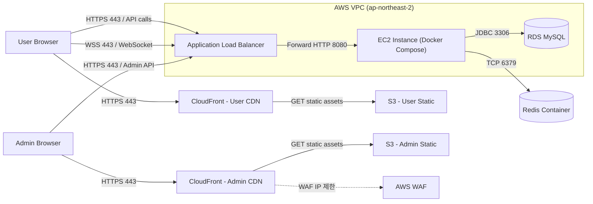
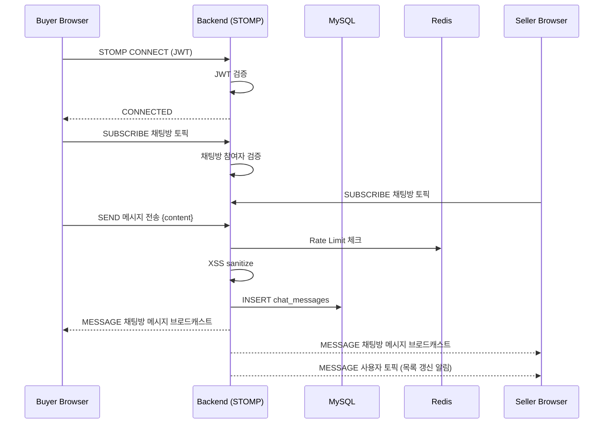
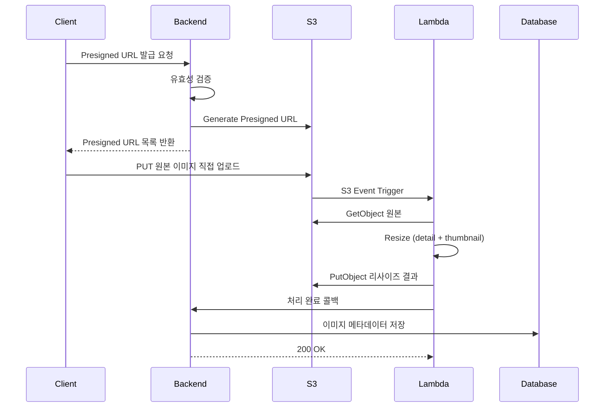

# System Overview

> Cherry 플랫폼의 인프라 구성 및 트래픽 흐름

> [!NOTE]
> 아래는 실제로 구현·운영했던 AWS 구조입니다. 현재는 AWS 무료 계정 종료로 공개 배포가 중단된 상태이며, 저비용 전환 설계는 [저비용 인프라 전환 설계](./low-cost-migration.md) 참조(미구현).

## Infrastructure

## Traffic Flow

### 1. 정적 리소스 서빙

- 사용자가 브라우저에서 서비스에 접속
- CloudFront가 S3에 업로드된 정적 파일(React/Vite 빌드 결과)을 서빙
- 브라우저는 동일 도메인에서 JS/CSS/이미지를 로드

### 1-1. 관리자 앱 서빙

- 관리자 전용 도메인으로 별도 CloudFront + S3 구성
- AWS WAF IP 화이트리스트로 접근 제한 (허용된 IP만 접속 가능)
- 사용자 앱과 물리적으로 완전 분리 (별도 버킷, 별도 배포)

### 2. API 요청 처리

- 브라우저에서 API 서버로 요청
- ALB(HTTPS 443)가 수신하여 EC2(HTTP 8080)로 포워딩
- Spring Boot가 비즈니스 로직 처리 중 RDS(MySQL)와 Redis를 사용
- 응답은 ALB를 통해 브라우저로 반환

### 3. 실시간 채팅 (WebSocket)

- 브라우저에서 ALB(WSS 443)를 통해 WebSocket 연결
- STOMP 프로토콜로 메시지 송수신
- 채팅방 토픽 구독으로 실시간 메시지 수신
- 사용자 토픽 구독으로 채팅 목록 실시간 갱신

## Real-time Chat Flow

## Image Upload Pipeline

Presigned URL 기반 클라이언트 직접 업로드 + Lambda 자동 리사이즈 파이프라인:

### Pipeline 특징

- **클라이언트 직접 업로드**: 서버 부하 없이 S3에 직접 업로드
- **이벤트 기반 처리**: S3 ObjectCreated 이벤트로 Lambda 자동 트리거
- **이중 리사이즈**: 상세 이미지(1280px) + 썸네일(256x256) 자동 생성
- **콜백 패턴**: Lambda → Backend 콜백으로 DB 메타데이터 동기화

## Deployment

### Frontend

GitHub Actions → S3 업로드 → CloudFront 캐시 서빙

### Backend

GitHub Actions → Docker 이미지 빌드 → GHCR push → EC2 docker compose 배포

## Security Boundary

- ALB에서 HTTPS 종료 (ACM 인증서)
- Frontend와 API가 다른 Origin이므로 CORS 정책 적용
- 원본 이미지 경로는 공개 접근 불가, 리사이즈 결과만 공개

### 관리자 보안 (4중 방어)

| 레이어 | 방어 수단 |
|--------|----------|
| 네트워크 | CloudFront WAF IP 화이트리스트 |
| 인증 | JWT + clientType 교차 검증 (앱-역할 일치 확인) |
| 인가 | Spring Security `hasRole("ADMIN")` |
| 감사 | AdminActionLog (IP, 기기 정보, 모든 관리 행위 기록) |
