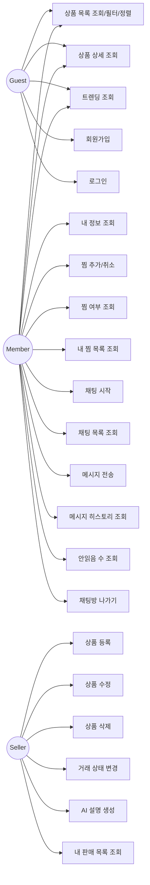

# Use Case Diagram (Backend Scope)

---

## 액터 정의

| 액터 | 설명 | 인증 |
|------|------|------|
| **Guest** | 비로그인 사용자 | 불필요 |
| **Member** | 로그인한 일반 사용자 (구매자) | JWT 필요 |
| **Seller** | 상품을 등록한 사용자 (판매자) | JWT 필요 + 소유권 검증 |

> Member와 Seller는 동일 사용자가 역할에 따라 전환됨. 별도 권한 체계 없이, 상품 소유 여부로 구분.

## 유스케이스 상세

### Guest (비로그인)

| 유스케이스 | 설명 |
|-----------|------|
| 상품 목록 조회/필터/정렬 | 커서 기반 페이지네이션, 동적 필터 (status, category, price, tradeType, sortBy) |
| 상품 상세 조회 | IP 기반 조회수 추적 (중복 방지) |
| 트렌딩 조회 | Redis Sorted Set 기반 상위 10개 |
| 회원가입 | 이메일/닉네임 중복 체크, BCrypt 해시 |
| 로그인 | JWT Access Token 발급 |

### Member (로그인)

| 유스케이스 | 설명 |
|-----------|------|
| 내 정보 조회 | 프로필 정보 반환 |
| 찜 추가/취소 | 유니크 제약 기반 중복 방지 |
| 찜 여부 조회 | Boolean 반환 |
| 내 찜 목록 | 커서 기반 페이지네이션 |
| 채팅 시작 | 기존 방 반환 or 신규 생성 (자기 상품 불가) |
| 채팅 목록 조회 | 최근 메시지 순 정렬, 안읽음 수 포함 |
| 메시지 전송 | 실시간 WebSocket, 멱등성 (clientMessageId) |
| 메시지 히스토리 | 커서 기반 역순 조회 |
| 안읽음 수 조회 | 전체 채팅방 안읽음 합계 |
| 채팅방 나가기 | leftAt 기반 숨김, 새 메시지 시 자동 복귀 |

### Seller (판매자)

| 유스케이스 | 설명 |
|-----------|------|
| 상품 등록 | Presigned URL 이미지 업로드 → PENDING 상태 |
| 상품 수정 | SELLING/RESERVED만 가능, 이미지 추가 시 PENDING 전환 |
| 상품 삭제 | Soft Delete (deleted_at 설정) |
| 거래 상태 변경 | 화이트리스트 기반 상태 전환 |
| AI 설명 생성 | Gemini API, 일일 횟수 제한 |
| 내 판매 목록 | 판매자 본인 상품만 조회 |
